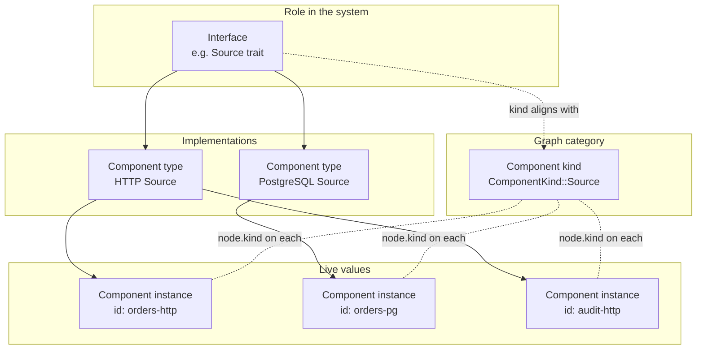

# Component Lifecycle in DrasiLib — current implementation

* Project Drasi - 2026-08-15 - _(author)_
* Draft 08 (drop condescending Terms lead-in; based on draft 07)
* Code: `drasi-core/lib/` (graph under `component_graph/`)

## Terms

**Interface** — A DrasiLib trait that defines a role in the system: what operations exist
and what the control plane can do with implementors. There are nine (listed below).
Examples: `Source`, `Query`, `Reaction`, `BootstrapProvider`. In code these are Rust traits
(`Source`, `Reaction`, …).

**Component kind** — The coarse category the component graph uses for nodes:
`ComponentKind` (`Source`, `Query`, `Reaction`, `BootstrapProvider`, `IdentityProvider`,
plus the graph root). For the five component-bearing variants, kind lines up with interface
one-to-one. Kind is *not* a specific implementation — every HTTP, PostgreSQL, or Kafka
source shares kind `Source`.

**Component type** — A concrete implementation of an interface: the thing you get from a
plugin (or static link) that knows how to construct instances. Example: load the HTTP Source
plugin → the HTTP Source **component type** (implements interface `Source`, kind `Source`).
Many component types share one interface/kind. Query is the odd case: instances are built
from `QueryConfig` inside DrasiLib; there is no plugin component type for queries.

**Component instance** — One constructed, identity-bearing value of a component type (or,
for queries, one query built from config). Example: source id `orders-http` is a
**component instance** of the HTTP Source type. The graph’s nodes and (for
lifecycle-managed kinds) the `runtimes` map refer to instances, not types.



**How they relate**

- Interface → many component types.
- Component type → many component instances.
- Component kind → many component instances (all types under that kind).
- The graph stores **instances** (and their kind). It does not store component types or
  plugins as nodes. Type is at best a string in instance metadata (`kind`, `pluginId`, …).

**Disambiguation**

- **DrasiLib instance** — one constructed `DrasiLib` (the container). Not a component
  instance. This document always says *DrasiLib instance* for the container.
- **Graph root** — node with `ComponentKind::Instance`. That enum variant means “the
  DrasiLib instance as a node,” not “component instance.” Prefer saying *graph root*.
- **`runtimes` map** — code name for the map of live component instances on the graph
  (`set_runtime` / `get_runtime`). Not the OS process or Tokio. Rename candidate: see
  Changes to make.

Where this document says *instance* alone, it means **component instance**.

### Interfaces (complete set)

| Interface | Defined in |
|---|---|
| `Source` | `lib/src/sources/traits.rs` |
| `Query` | `lib/src/queries/manager.rs` |
| `Reaction` | `lib/src/reactions/traits.rs` |
| `BootstrapProvider` | `lib/src/bootstrap/mod.rs` |
| `IdentityProvider` | `lib/src/identity/mod.rs` |
| `IndexBackendPlugin` | `core/src/interface/index_backend.rs` |
| `SecretStoreProvider` | `lib/src/secret_store/mod.rs` |
| `StateStoreProvider` | `lib/src/state_store/mod.rs` |
| `WalProvider` | `lib/src/wal/traits.rs` |

---

## Classification

Interfaces (and the instances created under them) differ along independent axes. The
**category** is the primary bucket; the other axes are attributes of how instances of that
interface are handled.

### Category (primary)

What relationship do instances of this interface have to DrasiLib's control plane?

| Category | Definition | Interfaces |
|---|---|---|
| **Lifecycle-managed** | Graph node **and** the component instance stored in the graph's `runtimes` map. DrasiLib registers, provisions, starts, stops, updates, removes. Uses the full `ComponentStatus` machine. | `Source`, `Query`, `Reaction` |
| **Topology-only** | Graph node for visibility/edges. Instance is **not** stored in `runtimes`. Status stays `Added`. No start/stop/update path on the graph. | `BootstrapProvider`, `IdentityProvider` |
| **Infrastructure** | Not a graph node. Instance injected on the `DrasiLib` builder. Lifecycle follows the DrasiLib instance. | `IndexBackendPlugin`, `StateStoreProvider`, `WalProvider`, `SecretStoreProvider` |

Category is predicted by: **is the component instance stored in the graph `runtimes` map?**
Yes → lifecycle-managed. Graph node but no `runtimes` entry → topology-only. No graph node →
infrastructure.

### Axes

| Axis | Values | Meaning |
|---|---|---|
| **Construction** | `host` · `lib` | Who creates the **component instance**. `host` = caller constructs it and hands it in. `lib` = DrasiLib constructs it from config it holds. |
| **Activity** | `active` · `passive` | Behaviour of the **component instance** once it exists. `active` = produces output on its own (streams changes, continuous query results, reaction side-effects). `passive` = only responds when invoked (fetch bootstrap data, resolve identity, read/write store, create indexes). |
| **Extension** | `descriptor` · `static-only` · `none` | How **component types** are supplied. `descriptor` = a `*PluginDescriptor` exists (static link or `drasi-host-sdk` dynamic load). `static-only` = interface only, no descriptor in the plugin SDK. `none` = not an extensible plugin kind (`Query` types are not plugin-defined). |
| **Cardinality** | `many-named` · `many-named-shared` · `singleton` · `attached` | How many component instances exist per DrasiLib instance and how they are addressed. |
| **Live-mutable** | `yes` · `no` | Can component instances of this interface be added/removed/replaced on an already-built DrasiLib instance? |

**Cardinality values:**

| Value | Meaning |
|---|---|
| `many-named` | Many component instances, each with an id; independently removable |
| `many-named-shared` | Named shared instances selected by name; not one graph node per consumer |
| `singleton` | At most one component instance per DrasiLib instance |
| `attached` | Component instance bound to another (bootstrap → source); not independently addressed by lib ops |

**Activity** is about produce-vs-respond, not about whether DrasiLib calls `start()`.
Lifecycle-managed interfaces today are all `active`; topology-only and infrastructure are
`passive`. A bootstrap provider instance does real work during bootstrap, but only when
invoked — it is `passive`.

### Applied to all nine interfaces

| Interface | Category | Construction | Activity | Extension | Cardinality | Live-mutable |
|---|---|---|---|---|---|---|
| `Source` | lifecycle-managed | host | active | descriptor (`SourcePluginDescriptor`) | many-named | yes |
| `Query` | lifecycle-managed | **lib** | active | **none** | many-named | yes |
| `Reaction` | lifecycle-managed | host | active | descriptor (`ReactionPluginDescriptor`) | many-named | yes |
| `BootstrapProvider` | topology-only | host | passive | descriptor (`BootstrapPluginDescriptor`) | attached | no |
| `IdentityProvider` | topology-only | host | passive | descriptor (`IdentityProviderPluginDescriptor`) | singleton (`identity-provider`) | no |
| `IndexBackendPlugin` | infrastructure | host | passive | descriptor (`IndexBackendPluginDescriptor`) | many-named-shared | no |
| `StateStoreProvider` | infrastructure | host | passive | static-only | singleton | no |
| `WalProvider` | infrastructure | host | passive | static-only | singleton | no |
| `SecretStoreProvider` | infrastructure | host | passive | descriptor (`SecretStorePluginDescriptor`) | singleton | no |

Example: load the HTTP Source plugin → component **type** "HTTP Source" (implements
`Source`). `add_source` with id `orders` → component **instance** of that type. That
instance is lifecycle-managed, host-constructed, active, live-mutable.

### Derived facts (from the axes)

These follow from the classification; they are not extra axes.

| Fact | True for |
|---|---|
| Graph node exists | lifecycle-managed, topology-only |
| Component instance in `runtimes` map (`set_runtime`) | lifecycle-managed only |
| Full status transitions used | lifecycle-managed only |
| `add` / `remove` / `update` on a live DrasiLib instance | lifecycle-managed only (`Live-mutable = yes`) |
| Dependencies validated at register (`Feeds`) | `Query` (sources), `Reaction` (queries) |
| Config reproducible without the live component instance | `Query` only (`Construction = lib`) |
| Plugin id can appear in node metadata | host may set it for descriptor-backed lifecycle-managed instances; graph does not model plugins or component types as nodes |
| Per-consumer sub-resource without graph identity | index sets per query (`create_indexes`); WAL registration per source |

### Why these axes (and not others)

- **Category** answers: what does DrasiLib actually manage for instances of this interface?
- **Construction** answers: whose failure is construct-time, and who holds config?
- **Activity** answers: does this instance push output, or only answer calls?
- **Extension** answers: can new **component types** arrive via plugin load, or only by linking?
- **Cardinality / live-mutable** answer: composition and clone/export shape.

"On the graph?" alone is insufficient — topology-only and lifecycle-managed both have nodes
but different lifecycles. "Has a plugin descriptor?" alone is insufficient —
infrastructure and lifecycle-managed both can. Type vs instance matters: the graph stores
**instances** (and opaque type hints in metadata like `kind`); it does not store component
types or plugins as nodes.

---

## Component graph

`ComponentGraph` is the shared registry for a `DrasiLib` instance — single source of truth
for which components exist, how they relate, and what state they are in. The three managers
(`SourceManager`, `QueryManager`, `ReactionManager`) share one
`Arc<RwLock<ComponentGraph>>` and keep no registry of their own.

It records:

1. which components exist
2. how they relate
3. each component's `ComponentStatus`
4. the live component instance for interfaces that store one (`runtimes` map)
5. recent lifecycle events

Beyond the registry it also provides:

- **Dependency tracking** — edges, plus `get_dependents` / `can_remove`
- **Status validation** — every node carries a `ComponentStatus`; transitions are checked
- **Events** — `broadcast::Sender` fans out `ComponentEvent`s on add, remove, status change
- **Status ingestion** — components report over a shared `mpsc`, drained by an external
  update loop calling `apply_update`. Managers mutate commanded transitions directly under
  the write lock. These are the two write paths.
- **Ordering** — `topological_order` for lifecycle operations
- **Event history** — recent events and last error, queryable per component

Source: module docs in `component_graph/mod.rs` and `graph.rs`.

### Layout

| File | Role |
|---|---|
| `mod.rs` | module docs, re-exports |
| `node.rs` | `ComponentNode`, `ComponentKind`, `RelationshipKind`, `ComponentUpdate`, `ComponentStatusHandle`, `GraphSnapshot` |
| `graph.rs` | `ComponentGraph` |
| `transaction.rs` | `GraphTransaction` |
| `wait.rs` | `wait_for_status` |

### Data held by `ComponentGraph`

| Field | Contents |
|---|---|
| `graph` | `petgraph::StableGraph<ComponentNode, RelationshipKind>` |
| `index` | `component_id → NodeIndex` |
| `instance_idx` | root node index |
| `runtimes` | `component_id → Box<dyn Any + Send + Sync>` (live component instances) |
| `event_tx` | `broadcast::Sender<ComponentEvent>` (capacity 1000) |
| `update_tx` | `mpsc::Sender<ComponentUpdate>` (capacity 1000) |
| `status_notify` | `Notify` woken on any status change |
| `event_history` | per-component recent events (up to 100 each) |

`ComponentGraph` itself is not `Send`/`Sync`. Callers always hold
`Arc<RwLock<ComponentGraph>>`.

`new(instance_id)` returns `(ComponentGraph, ComponentUpdateReceiver)`. The receiver must
be drained by an external update loop that calls `apply_update`.

### Nodes

```text
ComponentNode {
  id: String,
  kind: ComponentKind,
  status: ComponentStatus,
  metadata: HashMap<String, String>,   // opaque to the graph
}
```

| Kind | Role in the graph |
|---|---|
| `Instance` (graph root) | Root node for the DrasiLib instance. Created in `new()`. Status fixed at `Running`. Cannot be removed. Emits no `ComponentEvent` (`to_component_type()` → `None`). Excluded from `topological_order`. Not a component instance. |
| `Source` | Registered component |
| `Query` | Registered component |
| `Reaction` | Registered component |
| `BootstrapProvider` | Registered component |
| `IdentityProvider` | Registered component |

There is no plugin kind. Plugin identity, if recorded at all, is host-supplied metadata on
a component node (Drasi Server writes `pluginId` / `pluginVersion`). The association cannot
be traversed as a graph edge, and statically-linked components carry no plugin identity.

`add_component` rejects duplicate IDs. Every non-root node automatically gets
`Instance --Owns--> component` and `component --OwnedBy--> Instance`.

### Metadata

The graph does not interpret metadata. Callers set it at registration.

DrasiLib registration paths currently set:

| Key | Set for |
|---|---|
| `kind` | source, query, reaction, bootstrap, identity |
| `autoStart` | source, query, reaction |
| `query` | query (query text) |

Anything else is host-defined and carried through `snapshot()`.

### Relationships

Edges are always written as a bidirectional pair. `RelationshipKind::reverse()` defines the
mate. Adding an existing pair is a no-op. Edges are stateless and have no lifecycle of their
own.

| Forward | Reverse | Intended endpoints | Validated by `is_valid_relationship` |
|---|---|---|---|
| `Owns` | `OwnedBy` | Instance → any | Instance → any with `Owns` |
| `Feeds` | `SubscribesTo` | Source → Query, Query → Reaction | only those two |
| `Bootstraps` | `BootstrappedBy` | BootstrapProvider → Source | only that |
| `Authenticates` | `AuthenticatedBy` | IdentityProvider → Source/Reaction (any) | IdentityProvider → any with `Authenticates` |

| Method | Follows |
|---|---|
| `get_neighbors(id, kind)` | outgoing edges of that kind |
| `get_dependencies(id)` | outgoing `SubscribesTo` |
| `get_dependents(id)` | outgoing `Feeds` |
| `can_remove(id)` | errors if `get_dependents` is non-empty |
| `topological_order()` | toposort over **only** `Feeds` edges; excludes Instance |

`can_remove` / `deregister` only consider data-flow dependents (`Feeds`). Bootstrap and auth
edges do not block removal.

### Component instance store (`runtimes` map)

Separate from the petgraph node data. Code field name: `runtimes`.

```text
set_runtime(id, Box<dyn Any + Send + Sync>)  // node must already exist
get_runtime::<T>(id) -> Option<&T>
take_runtime::<T>(id) -> Option<T>
has_runtime(id) -> bool
```

`set_runtime` fails if the node is missing. In debug builds it warns if the stored type is
not `Arc<dyn Source|Query|Reaction>` for those kinds.

`remove_component` also removes any `runtimes` entry for that id.

The graph does not construct component instances. It only stores what callers put there.
`GraphTransaction` does not cover the `runtimes` map.

Only `Source`, `Query` and `Reaction` ever get a component instance stored (six `set_runtime`
call sites in the managers). `BootstrapProvider` and `IdentityProvider` get a node and
nothing else.

**Registry-first:** the node must exist before a component instance is stored against it.
`provision_source` requires the caller to have called `register_source` first. This is
ordering inside the graph, not construction order — sources and reactions arrive already
constructed; only `Query` is built inside DrasiLib.

### Status

Every node carries a `ComponentStatus`, whether or not its type uses the transitions:

`Added` · `Starting` · `Running` · `Stopping` · `Stopped` · `Reconfiguring` · `Error` · `Removed`

Allowed transitions (`is_valid_transition` in `graph.rs`):

```text
Added         → Starting | Stopped | Reconfiguring
Stopped       → Starting | Reconfiguring
Starting      → Running | Error | Stopped | Stopping
Running       → Stopping | Stopped | Error | Reconfiguring
Stopping      → Stopped | Error
Error         → Starting | Stopped | Reconfiguring
Reconfiguring → Stopped | Starting | Error
```

- `Added` and `Removed` are structural. They are written by add/remove, not by
  `validate_and_transition`.
- Same-status updates are no-ops (no event).
- `Error → Starting` is legal, so recovery is permitted — but no code path in DrasiLib
  performs it automatically. It always requires an explicit caller.
- A component can move itself to `Error` with no caller involved, via the status channel.

#### Two write paths

| Path | Used for | Invalid transition behavior |
|---|---|---|
| Manager holds write lock → `validate_and_transition` | commanded moves (`Starting`, `Stopping`, `Reconfiguring`) | **returns `Err`** |
| Component → `mpsc::ComponentUpdate` → update loop → `apply_update` | component-reported (`Running`, `Stopped`, `Error`) | **warns and ignores** |

Components do not take the graph lock to report status. They use `ComponentStatusHandle`,
which updates a local `Arc<RwLock<ComponentStatus>>`, a local `watch` channel, and (if
wired) the graph mpsc sender.

`wait_for_status` waits on `status_notify` with a timeout.

### Registration helpers

These are the typed entry points managers use. Each starts a transaction, adds the node at
status `Added`, adds edges, commits (events emit on commit).

| Method | Creates | Also creates | Pre-checks |
|---|---|---|---|
| `register_source(id, metadata)` | Source node | ownership edges | id free |
| `register_query(id, metadata, source_ids)` | Query node | ownership + `Feeds` from each source | id free; every source exists |
| `register_reaction(id, metadata, query_ids)` | Reaction node | ownership + `Feeds` from each query | id free; every query exists |
| `register_bootstrap_provider(id, metadata, source_ids)` | BootstrapProvider node | ownership + `Bootstraps` to each source | id free; every source exists |
| `register_identity_provider(id, metadata, component_ids)` | IdentityProvider node | ownership + `Authenticates` to each target | id free; every target exists |
| `deregister(id)` | — | removes node, edges, `runtimes` entry, history | `can_remove`; not Instance |

Registration does **not** store a component instance. Callers that need one call `set_runtime`
later.

### Transactions

`begin()` → `GraphTransaction`:

- `add_component(node)`
- `add_relationship(from, to, forward)`
- `commit()` — emits deferred add events and records history

Drop without commit removes added nodes and edges. The `runtimes` map is outside the
transaction. If storing or initializing the component instance fails after commit, callers
must compensate with `deregister` / `remove_component`.

### Events

On add, remove, and successful status change the graph:

1. broadcasts a `ComponentEvent` on `event_tx`
2. records it in `event_history` (except Instance, which has no event type)

| API | Behavior |
|---|---|
| `subscribe()` | broadcast receiver for all graph events |
| `get_events(id)` / `get_all_events()` | history queries |
| `get_last_error(id)` | last error message in history |
| `subscribe_events(id)` | history snapshot + per-component live receiver |

### Snapshot

`snapshot()` → `GraphSnapshot { instance_id, nodes, edges }`.

Includes every node (with status and metadata) and every edge. Excludes the `runtimes` map,
event history, and any configuration objects not stored on the node.

### Public surface

| Group | Methods |
|---|---|
| Construct / wire | `new`, `instance_id`, `subscribe`, `event_sender`, `update_sender`, `status_notifier`, `apply_update` |
| Nodes | `add_component`, `remove_component`, `get_component`, `get_component_mut`, `contains`, `list_by_kind`, `node_count` |
| Component instances (`runtimes`) | `set_runtime`, `get_runtime`, `take_runtime`, `has_runtime` |
| Edges | `add_relationship`, `remove_relationship`, `get_neighbors`, `get_dependencies`, `get_dependents`, `edge_count` |
| Lifecycle | `validate_and_transition`, `can_remove`, `topological_order` |
| Typed register | `register_source`, `register_query`, `register_reaction`, `register_bootstrap_provider`, `register_identity_provider`, `deregister` |
| Transaction | `begin` → `GraphTransaction::{add_component, add_relationship, commit}` |
| History | `record_event`, `get_events`, `get_all_events`, `get_last_error`, `subscribe_events` |
| Export | `snapshot` → `GraphSnapshot { instance_id, nodes, edges }` |
| Wait (free function) | `wait_for_status` |

### What the graph does not model

These exist in DrasiLib but are not graph nodes and have no edges here:

- index backend providers
- state store provider
- WAL provider
- secret store provider
- plugins / plugin descriptors

Bootstrap and identity providers *can* be nodes, but the graph does not drive their
lifecycle: no component instance is stored for them by current callers, and nothing
transitions their status after `Added`.

---

## Classification notes (current quirks)

Facts that the axes describe but do not soften:

- **`Query` is the only `Construction = lib` interface.** Instances built from `QueryConfig`.
  Per-query index structures are also created inside DrasiLib, via a host-supplied
  `IndexBackendPlugin` factory (`create_indexes(query_id)`).
- **`IdentityProvider` is topology-only *and* infrastructure-shaped.** Singleton instance
  injected on the builder, and also registered as a graph node under hard-coded id
  `identity-provider`. `Authenticates` edges are drawn once at build against component
  instances present then; instances added later are never linked, so those edges go stale.
  The node is unused by lifecycle code ("reserved for future use").
- **`BootstrapProvider` is `attached`.** Host sets the bootstrap instance on the source
  instance before hand-over. The optional graph node is for topology only. Drasi Server
  treats bootstraps as top-level named config components — a lib/server mismatch (see
  Bootstrap provider section).

---

## Where the DrasiLib boundary sits

*Host* here means the code that creates and owns the `DrasiLib` instance and hands
components to it — in Drasi Server, the server itself. It is the counterpart to DrasiLib in
the Owner column throughout. Where this document means the plugin-loading SDK — cdylib
loader, FFI proxies, callbacks, reverse vtables — it says `drasi-host-sdk` in full, never
"host".

Everything except `Query` is constructed by the host and handed over as a component
instance. DrasiLib never constructs or destroys those instances — it registers, provisions,
starts, stops, releases. Disposal is the host's again. Two consequences:

- A segment DrasiLib cannot observe: before hand-over and after release. A construction
  failure never reaches DrasiLib — the host fails first.
- For host-constructed instances, config lives outside DrasiLib and is recoverable only by
  asking the live instance via `properties()`. Configuration capture therefore depends on
  live component instances.

`BootstrapProvider` is attached to a source instance *before* hand-over, so DrasiLib only
ever sees it as an attribute of a source (plus an optional topology node).

DrasiLib holds the config for a `Query` and constructs the instance, so a `Query` is the
only interface whose configuration DrasiLib can reproduce without consulting a live
component instance.

---

## Source

**Lifecycle: full.**

| Stage | Owner | Notes |
|-------|-------|-------|
| Construct | **Host** | Built outside DrasiLib and handed in fully formed. |
| Register | DrasiLib | Node created with status `Added`, plus ownership edges. |
| Provision | DrasiLib | `initialize()` supplies the source context. No external I/O. Instance stored via `set_runtime`. |
| Start | DrasiLib | `Starting` → `start()` → `Running`. This is where the external system is contacted. Failure sets `Error`. |
| Stop | DrasiLib | `Stopping` → `stop()` → `Stopped`. A failed stop lands in `Error` rather than sticking at `Stopping`. |
| Teardown | DrasiLib | Refuses to delete while `Stopping` or `Reconfiguring`. A `cleanup` flag selects whether the provider is deprovisioned or merely unregistered. |
| Update | DrasiLib | Component instance replaced via `Reconfiguring`. |
| Dispose | **Host** | After release, disposal of the component instance is outside DrasiLib. |

- `auto_start` is a trait method on the source, defaulting to `true`.
- **Subscription is not part of start.** A source accepts subscriptions without being
  started and without reaching its external system, and it waits for subscribers before
  producing. Wiring and connecting are already independent for this type.
- After all auto-start queries have subscribed, DrasiLib signals every running source that
  the initial subscription window has closed.
- **No failure detection.** DrasiLib does not monitor a running source. If its connection
  drops, the source must report that itself.
- Uses every status.

---

## Bootstrap provider

**Lifecycle: none.**

A bootstrap provider gets a graph node with status `Added` and an edge to each source it
serves. That node never transitions again.

It has no component instance in `runtimes`, no `initialize()`/`start()`/`stop()`, no add,
remove, or update operation, no `auto_start`, and no status of its own beyond the pinned
`Added` node.

It is **owned by its source**: constructed by the host and attached before the source is
handed to DrasiLib, and its work runs inside the source's bootstrap path. Its failures
surface as source or query failures. The node exists for topology visibility only.

> **Mismatch with Drasi Server.** Drasi Server now treats bootstrap providers as top-level
> configuration components with their own IDs and reference-by-name. DrasiLib still models
> them as source attributes with no independent identity or lifecycle. Making them
> first-class in the lib would be a change, not a clarification.

---

## Query

**Lifecycle: full, and entirely internal.**

| Stage | Owner | Notes |
|-------|-------|-------|
| Construct | **DrasiLib** | Built from a `QueryConfig`. Unlike other interfaces, no host-supplied instance is handed in. |
| Register | DrasiLib | **Validates that every referenced source exists**, then creates the node and dependency edges. |
| Provision | DrasiLib | `initialize()` supplies the query context. Instance stored via `set_runtime`. |
| Start | DrasiLib | The query is compiled, subscribes to its sources, and runs bootstrap. |
| Stop / Teardown / Update | DrasiLib | As for sources. |

- `auto_start` is a field on `QueryConfig`, not a trait method — unlike sources and
  reactions.
- **Bootstrap gates `Running`.** A query stays in `Starting` for the whole of bootstrap,
  which may be long. `Starting` means "not yet caught up", not "briefly initializing".
- **The query is not compiled until start.** An invalid query is added successfully and
  fails only when started, so a created query is not yet a known-valid query.
- Recovery from an unavailable source position is a single in-line retry governed by the
  configured policy; it either succeeds within `start()` or the query lands in `Error`.
- **Queries are the only type whose start failure is non-fatal to instance startup.**
  DrasiLib logs and continues when queries fail to start, while source and reaction
  failures abort the instance start.

---

## Reaction

**Lifecycle: full, and the only type with failure detection.**

| Stage | Owner | Notes |
|-------|-------|-------|
| Construct | **Host** | Built outside DrasiLib and handed in fully formed. |
| Register | DrasiLib | **Validates that every referenced query exists**, then creates the node and dependency edges. |
| Provision | DrasiLib | `initialize()` supplies the reaction context. No external I/O. Instance stored via `set_runtime`. |
| Start | DrasiLib | A configuration check runs first (below), then the reaction starts, subscribes to its queries, and bootstraps before processing begins. |
| Stop | DrasiLib | Moves to `Stopping` first, deliberately, so the supervisor does not mistake a deliberate stop for a failure. |
| Teardown | DrasiLib | Subscription and supervisor tasks are cancelled. |
| Update | DrasiLib | Component instance replaced via `Reconfiguring`. |
| Dispose | **Host** | After release, disposal of the component instance is outside DrasiLib. |

- `auto_start` is a trait method, as for sources.
- **A configuration rule is enforced at start**: a reaction that requires durable state is
  rejected when no durable state store is configured. This is a configuration error, but it
  can only be evaluated against a constructed instance, so it surfaces as a start failure.
- **Failure detection exists, but only detection.** A supervisor watches the reaction's
  subscriptions and moves it to `Error` if they are all lost while it is `Running`. It does
  not resubscribe, retry, or restart.

---

## Identity provider

**Lifecycle: none, though it is on the graph.**

When configured, a node is registered at build time under the hard-coded ID
`identity-provider`, with `Authenticates` edges to every source and reaction present at that
moment. The code calls registration "reserved for future use… not yet implemented in the
component lifecycle" — true of the lifecycle, but the node is created.

The node stays at `Added`. The provider itself works normally: it is supplied to sources and
reactions via their context structs and can be overridden per component. No code reads the
node.

No add, remove or update; only one can exist. It is absent from configuration capture, which
is why Drasi Server's clone and export lose identity provider associations.

---

## Providers

Index backends, state stores, WAL and secret stores are supplied at build time: no node, no
status, no transitions, no `runtimes` entry, no way to add, replace or remove one on a live
DrasiLib instance. Their lifecycle *is* the instance's. Identity is listed for comparison —
delivered the same way, but it also has a graph node.

| Provider | Multiplicity | Reaches components via | Per-component step |
|---|---|---|---|
| Index backend | Named, many; a query selects one by name | Internal query construction | `create_indexes(query_id)` per query |
| State store | Singleton | Source and reaction context | Partitioned by `store_id` |
| WAL | Singleton | Source context | `register(source_id, config)` before use |
| Identity | Singleton | Source and reaction context | — |
| Secret store | Singleton | Not passed to components at all | — |

Two carry a hidden per-component sub-lifecycle: the index backend creates a distinct index
set per query, and the WAL requires each source to register before appending. Neither is on
the graph or in the status model, so neither can fail as a visible lifecycle event.

The secret store is consumed while configuration is resolved — before components are
constructed — and never reaches one.

`Query` receives no providers at all: `QueryRuntimeContext` carries only instance ID, query
ID, and status handle, because DrasiLib wires query indexes directly.

---

## Summary — graph components

Providers are omitted; the answer is uniform for all of them and given in the Providers
section.

| | Source | Bootstrap provider | Query | Reaction | Identity provider |
|---|---|---|---|---|---|
| Constructed | **Outside** | **Outside**, via its source | **Inside** | **Outside** | **Outside** |
| Graph node | ✅ | ✅ | ✅ | ✅ | ✅ (unused) |
| Component instance in `runtimes` | ✅ | ❌ | ✅ | ✅ | ❌ |
| `add`/`remove`/`update` | ✅ | ❌ | ✅ | ✅ | ❌ |
| Uses status transitions | ✅ all | ❌ pinned `Added` | ✅ all | ✅ all | ❌ |
| Dependencies validated at register | — | — | sources exist | queries exist | — |
| `auto_start` lives on | trait method | n/a | config field | trait method | n/a |
| Failure detection | ❌ | n/a | ❌ | ✅ detect only | n/a |
| Start failure at instance start | fatal | n/a | **non-fatal** | fatal | n/a |
| Captured in configuration snapshot | ✅ | ✅ via source | ✅ | ✅ | ❌ |

---

## Observations

Recorded as input to later design work, not as proposals.

1. **Only three of the nine interfaces are lifecycle-managed.** Bootstrap and identity
   providers have graph presence without graph behavior; the four injected providers have
   neither. The predictor is whether a component instance is stored in the graph's `runtimes`
   map.
2. **The graph is an incomplete dependency model.** It records source, query, reaction and
   bootstrap relationships, but not the provider dependencies — index backend, state store,
   WAL — that a component equally requires in order to function.
3. **Singleton providers cannot participate in live composition.** Because they exist only at
   build time, they cannot be added to a live DrasiLib instance, and anything built on
   per-instance composition inherits that limit.
4. **Identity provider edges are a build-time snapshot.** They are drawn once against the
   components present at build, and never updated for components added later.
5. **Bootstrap providers are first-class in Drasi Server and second-class in DrasiLib.**
6. **Creation does not establish validity.** A query is compiled only at start, so it can be
   created successfully and still be invalid.
7. **Some configuration errors are only detectable after construction**, because they depend
   on properties of the constructed instance rather than of its config. No purely static
   validation pass can catch them.
8. **Wiring is already separable from connecting** for sources, which accept subscriptions
   before being started.
9. **Terminal versus non-terminal is decided by component type, not by cause.** A query
   failing to start is non-fatal; a source failing to start is fatal — regardless of whether
   the cause was a typo or an unreachable system.
10. **`Error` conflates "misconfigured" with "disconnected."** Both reach the same state,
    distinguished only by a free-text message.
11. **Nothing leaves `Error` on its own.** The transition is legal but is never performed
    automatically. Reactions can detect subscription loss; no type can recover from it.
12. **Commanded and reported status paths disagree on invalid transitions.**
    `validate_and_transition` returns `Err`; `apply_update` warns and ignores.
13. **Plugin identity is metadata, not topology.** No plugin node or edge; association is
    non-traversable string keys, absent for statically-linked components.
14. **`GraphTransaction` does not cover the `runtimes` map.** Failure while storing or initializing a component instance after commit requires compensating `deregister` /
    `remove_component`.

---

## Changes to make

Actionable follow-ups from this review. Not a design of the end state — a backlog of
concrete fixes and renames. Ordered roughly by cost vs confusion removed.

### Naming / API clarity

1. **Rename `ComponentGraph.runtimes` → `instances` (or `component_instances`).**  
   The field holds component instances (`Arc<dyn Source|Query|Reaction>`). The comment at
   introduction already said "runtime instances"; the shortened field name `runtimes` collides
   with process/Tokio "runtime" and fights the type/instance vocabulary.  
   Rename with it: `set_runtime` → `set_instance`, `get_runtime` → `get_instance`,
   `take_runtime` → `take_instance`, `has_runtime` → `has_instance`.  
   Introduced in `de6064a7` (Runtime plugins #349, 2026-04-14).

2. **Rename `ComponentKind::Instance` (graph root).**  
   It is the DrasiLib instance as a node, not a component instance. Prefer something like
   `DrasiLib` / `Root` / `Container` so it does not collide with "component instance."

3. **Stop using "runtime" in public docs/comments for component instances.**  
   Prefer *component instance*, *component type*, *interface*, *kind* as defined in Terms.
   Keep "runtime" only where it means execution environment or an existing type name that
   cannot move yet (e.g. `QueryRuntimeContext` — separate rename pass).

### Graph model honesty

4. **Decide the role of topology-only nodes (bootstrap, identity).**  
   Today they look like component instances on the graph but have no `runtimes` entry, no
   status transitions, and (for identity) stale edges. Either:
   - make them real lifecycle-managed or at least consistently updated instances, or
   - stop presenting them as peer nodes and record them only as metadata/edges on the
     components that use them.

5. **Align bootstrap with Drasi Server.**  
   Server: top-level named bootstrap config. Lib: attached to source, optional shadow node.
   Pick one model and implement it on both sides.

6. **Keep identity edges current — or drop them.**  
   `Authenticates` is drawn once at build; live-added sources/reactions never get edges.
   Either maintain edges on add/remove, or remove unused topology until lifecycle uses it.

7. **Put provider dependencies in the dependency story.**  
   Index backend, state store, WAL (and secret store at resolve time) are required for
   correct operation but are invisible to `get_dependencies` / `can_remove` / `snapshot`
   topology. At minimum document the gap in API terms; longer term consider explicit links
   or a non-graph registry the control plane can query.

### Lifecycle / status

8. **Split or qualify `Error`.**  
   Misconfiguration vs disconnect vs dependency loss are different outcomes; today they share
   one state and a free-text message. Matters for terminal vs non-terminal reporting and for
   auto-recovery policy.

9. **Define recovery policy for `Error`.**  
   `Error → Starting` is legal but never automatic. Reactions detect subscription loss only.
   Decide what leaves `Error` and what remains operator-driven.

10. **Unify invalid-transition handling.**  
    `validate_and_transition` returns `Err`; `apply_update` warns and ignores. Same state
    machine should not have two silent/loud policies without an explicit reason.

11. **Revisit "query start failure is non-fatal, source/reaction is fatal" at DrasiLib
    instance start.**  
    Today severity is by interface kind, not by failure cause. Align with whatever
    admit/activate success means for multi-component load (config OK vs external connect OK).

12. **Validate what can be validated at register/create, not only at start.**  
    Query compile-at-start and reaction durable-store checks mean "created" ≠ "known valid."
    Move static checks earlier where possible; name the residual class of start-only failures.

### Transactions / multi-component load

13. **Extend transactional semantics past graph nodes/edges.**  
    `GraphTransaction` does not cover the instances map or initialize/start. Multi-component
    load (solutions, clone) needs a defined success boundary and compensating actions —
    registry-first alone is not atomic deploy.

14. **Include component instances in any export/clone story deliberately.**  
    `snapshot()` is topology only (nodes, edges, metadata). Config for host-built instances
    still depends on `properties()` of live instances. Define what clone/solution capture
    must include (types, plugin ids, configs, autoStart) vs graph snapshot alone.

### Extension / types

15. **Represent component type identity more than `metadata.kind`.**  
    Graph has instances and kinds; component types and plugins are not nodes. For export,
    reload, and "same type" reasoning, define where type id + plugin id/version live
    (structured fields vs opaque metadata) and require them for descriptor-backed instances.

---

*End of draft 06.*
