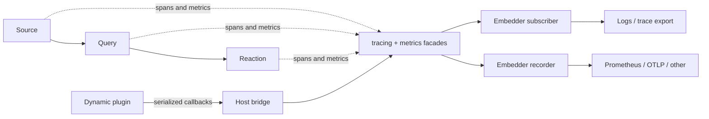

# Observability for drasi-lib - Overview and Shared Foundations

* Project Drasi - Ruokun Niu (@ruokun-niu)
* Last edited on August 20th, 2026

> **Document set.** This document describes the shared architecture. Signal-specific contracts are
> defined in:
>
> | Document | Covers |
> |----------|--------|
> | [01 - Tracing](01-tracing.md) | Span hierarchy, context propagation, FFI contracts, and plugin spans |
> | [02 - Metrics](02-metrics.md) | Metric definitions, collection, plugin metrics, storage metrics, and naming |

## Overview

drasi-lib will add traces and metrics around the Source -> Query -> Reaction pipeline. Traces show
how an individual event moves through the pipeline; metrics summarize throughput, latency, queue
pressure, errors, and component health across many events.

drasi-lib emits both signals through the Rust `tracing` and `metrics` facades. The embedding
application owns the process-global subscriber, recorder, filtering, export, and shutdown flush.
The existing `ComponentLogLayer` remains part of the subscriber composition so per-component logs
continue to work.

## Terms and Definitions

| Term | Definition |
|------|------------|
| Facade | An API that emits telemetry without choosing its storage or export backend. |
| Subscriber | The embedder-owned `tracing::Subscriber` that receives spans and events. |
| Recorder | The embedder-owned `metrics::Recorder` that receives metric updates. |
| Host | drasi-lib and its embedding application, which load plugins and own telemetry export. |
| Dynamic plugin | A cdylib loaded through `drasi-host-sdk`, with its own Rust global subscriber and recorder. |

## Objectives

### User Scenarios

1. An embedder wants to follow one source event through query processing and reaction delivery.
2. An operator wants to monitor pipeline throughput, latency, queue depth, and failures.
3. A plugin author wants standard `tracing` and `metrics` instrumentation to appear in the host's
   telemetry output for both static and dynamic builds.

### Goals

- Add connected spans at pipeline and plugin boundaries.
- Add a stable set of counters, gauges, and histograms for operational health.
- Preserve existing per-component logging.
- Keep collection backend-neutral and controlled by the embedder.
- Keep disabled instrumentation near-zero cost.

## Design Requirements

### Requirements

1. **Facade-only:** drasi-lib does not install a `tracing::Subscriber` or `metrics::Recorder`.
2. **Connected traces:** context crosses every async task and dynamic-plugin boundary. For a source change event, we should observe the full end-to-end trace that flows from Sources through Lib and to Reactions.
3. **Stable identity:** spans and metrics carry component identifiers as fields or attributes.
4. **Backend-neutral metrics:** names follow OpenTelemetry conventions under `drasi.`; units and
   instrument type remain metadata.
5. **Compatible logging:** `ComponentLogLayer`, `ComponentLogRegistry`, and the `log` bridge remain
   functional.
6. **Host control:** the host controls filtering, sampling, export, and shutdown flush.

### Dependencies

- drasi-lib adds the `metrics 0.24` facade and continues using `tracing`.
- Dynamic plugin telemetry requires append-only SDK and FFI additions described in the signal
  documents.
- Embedders choose subscriber layers, recorders, and exporters such as Prometheus or OTLP.

### Out of Scope

Drasi Server wiring is defined in
[Drasi Server Observability Integration](../../drasi-server/tracing-logging/00-observability-integration.md).
Detailed span and metric definitions remain in [01 - Tracing](01-tracing.md) and
[02 - Metrics](02-metrics.md).

## Design

### High-Level Design



drasi-lib owns instrumentation and context propagation. The embedder owns collection and export.
Static plugins use the host's facade globals directly. Dynamic plugins serialize telemetry across
FFI and the host feeds it into the same central pipeline.

### Pipeline Model and Instrumentation Points

The pipeline spans five Tokio tasks connected by channels and priority queues:

```text
Source Plugin -> Query Forwarder -> Query Processor -> Reaction Forwarder -> Reaction Processor
```

The designs use the following interval labels:

| Interval | Measurement |
|---|---|
| A | Source dispatch: wrap a change and send it to the query channel |
| B | Source-to-query channel wait |
| C | Query priority-queue wait |
| D | Query-engine execution inside `process_source_change()` |
| E | Result conversion and dispatch to reaction channels |
| F | Query-to-reaction channel wait |
| G | Reaction queueing and plugin processing |

`A→G` means the complete measured path from source dispatch through reaction completion.

Tracing records the path of an individual event across these boundaries. Metrics aggregate the
same boundaries into throughput, latency, queue, error, and health instruments. Existing
`ProfilingMetadata` timestamps provide the source for end-to-end and stage latency measurements.

### Tracing Overview

- Host pipeline spans form one tree from source dispatch through query processing and reaction
  delivery.
- Span context is attached explicitly to messages that cross Tokio task boundaries.
- Valid incoming W3C context becomes the parent of the source-side trace.
- drasi-core's existing debug spans naturally nest beneath the host's `query.process` span.
- For a source change originating in a dynamic plugin, the plugin creates `source.produce` (or
  adopts valid context from the upstream protocol) and attaches its `FfiTraceContext` to the
  `FfiSourceEvent`. The host continues the trace by creating `source.dispatch` beneath that parent.
  In the other direction, host-to-plugin calls carry the host's current context into the plugin.
  Completed plugin spans return to the host as `FfiCompletedSpan` callbacks for export.

The complete span names, fields, parenting rules, and flow diagrams are in
[01 - Tracing](01-tracing.md).

### Metrics Overview

- Counters measure processed events, emitted results, errors, drops, and blocked enqueues.
- Gauges report component health, queue depth, and checkpoint lag.
- Histograms measure query-engine and end-to-end pipeline duration.
- Handles are registered outside hot loops and updated through the `metrics` facade.
- The embedder installs one recorder and chooses Prometheus, OTLP, or another compatible backend.
- For a dynamic plugin, the SDK installs an `FfiMetricsRecorder`. Each counter, gauge, or histogram
  update is converted to `FfiMetricEntry` and sent through a callback. The host receives the entry
  and records the same update in its process-wide recorder.

The committed instruments, labels, cost controls, storage metrics, and future metrics are in
[02 - Metrics](02-metrics.md).

### Plugin Telemetry Across FFI

Live `tracing::Span` and `metrics` handles cannot cross a cdylib ABI. Dynamic plugins therefore use
flat, C-compatible records:

| Signal | Into plugin | Back to host | Host handling |
|--------|-------------|--------------|---------------|
| Traces | `FfiTraceContext` | `FfiCompletedSpan` through `SpanCallbackFn` | `PluginSpanSink` exports the completed span |
| Metrics | Host-installed recorder callback | `FfiMetricEntry` through `MetricsCallbackFn` | Host re-emits the update through its recorder |

The bridge is library-scoped and installed once per loaded plugin library. This lets plugin authors
use normal `tracing` and `metrics` APIs without owning an exporter. The host retains control over
sampling, filtering, and destinations.

Plugin-specific span tiers are defined in [01 - Tracing](01-tracing.md#standard-spans-for-component-plugins),
and metric tiers are defined in [02 - Metrics](02-metrics.md#81-the-three-tiers).

### Observability Profiles

`TelemetryProfile` provides shared presets while preserving the ownership boundary:

| Profile | Purpose |
|---------|---------|
| `off` | No traces or metrics |
| `basic` | Core pipeline spans and operational metrics |
| `debug` | Full tracing and additional diagnostics |
| `persistence` | Core telemetry plus storage metrics and engine statistics |

Resolving a profile returns trace directives, a metric deny list, and collection flags. The
embedder installs the directives and metric filter; drasi-lib receives the collection flags during
construction. Backend statistics that must be enabled before provider construction remain the
embedder's responsibility.

Metric filters are exclusion-only substring patterns because that is the behavior provided by
`metrics_util::layers::FilterLayer`. Filters can suppress emitted metrics but cannot enable
collection that a profile leaves off. Dynamic plugins receive the effective enablement through the
library-scoped bridge so disabled telemetry can be dropped before an FFI call.

### Naming and Namespacing Conventions

| Signal | Convention |
|--------|------------|
| Metrics | Lowercase dotted names under `drasi.`; units and instrument type are metadata; identity is carried in attributes |
| Spans | Lowercase dotted names without a `drasi.` prefix; identity is carried in fields and instrumentation scope |

See [metric naming](02-metrics.md#9-naming-and-namespacing-conventions) and
[span naming](01-tracing.md#span-naming-and-namespacing) for the full rules.

### Enabling Telemetry as a drasi-lib Consumer

The embedder performs setup before constructing `DrasiLib`:

1. Resolve the selected `TelemetryProfile`.
2. Compose and install one tracing subscriber containing `ComponentLogLayer`, filtering,
   formatting, and optional trace export.
3. Build the selected metrics recorder, wrap it in the profile's `FilterLayer`, and install it.
4. Pass the profile's collection flags to `DrasiLibBuilder`.
5. On shutdown, stop `DrasiLib`, then flush embedder-owned exporters before runtime teardown.

Without a subscriber or recorder, facade calls remain disabled and nothing is exported.

### API Design

Pipeline instrumentation does not change the REST API, CLI, or component traits. The telemetry
initialization surface is:

| Function | Behavior |
|----------|----------|
| `init_component_log_layer()` | Returns `ComponentLogLayer` without installing a subscriber |
| `init_default_subscriber()` | Installs the existing default logging composition for simple embedders |
| `TelemetryProfile::resolve()` | Returns trace directives, metric filters, and collection flags |

`get_or_init_global_registry()` is replaced by the two explicit initialization functions so custom
embedders can compose the component log layer with trace export.

### Alternatives Considered

- **Install exporters in drasi-lib:** rejected because a library must not claim process-global
  subscriber or recorder ownership.
- **Give dynamic plugins their own exporters:** rejected because it bypasses host filtering and
  duplicates configuration and connections.
- **Pass live telemetry handles across FFI:** rejected because Rust subscriber and recorder handles
  are not ABI-safe.

### Phase Plan

| Phase | Scope |
|-------|-------|
| 0 | Host pipeline spans, core operational metrics, and composable initialization |
| 1 | Dynamic-plugin trace and metric bridges, plugin baseline telemetry, and profiles |
| 2 | Additional plugin, storage, management-plane, and retrospective telemetry |

## Security

Telemetry may contain component identifiers and operational measurements, but must not contain
credentials, query text, payload data, or secret configuration. Export transport security and
collector authentication are owned by the embedder.

## Compatibility Impact

- Existing `log` calls and per-component log subscriptions continue to work.
- Existing embedders see additional spans only when their subscriber enables them.
- Metrics are no-ops until an embedder installs a recorder.
- Replacing `get_or_init_global_registry()` is a deliberate initialization API change.
- Dynamic plugin ABI additions are append-only and gated by SDK version.

## Supportability

### Telemetry

| Signal | Produced by drasi-lib | Enabled by embedder |
|--------|-----------------------|---------------------|
| Logs | Existing structured component events | Subscriber with `ComponentLogLayer` and optional formatting/export |
| Traces | Pipeline, control-plane, and plugin spans | Subscriber with filtering and optional OpenTelemetry layer |
| Metrics | Counters, gauges, and histograms | Any compatible `metrics::Recorder` |

### Verification

Shared integration tests verify that:

- component log streams continue to receive events;
- one event produces a connected Source -> Query -> Reaction trace;
- the same plugin telemetry is visible in static and dynamic builds;
- metrics reach an installed test recorder and remain no-ops without one;
- profile filtering and collection flags are both applied;
- shutdown flushes embedder-owned trace and OTLP metric providers.

Signal-specific verification is defined in [01 - Tracing](01-tracing.md#verification) and
[02 - Metrics](02-metrics.md#verification).

## Open Issues

None. Signal-specific future work is tracked in the tracing and metrics documents.

## References

- [`tracing` crate](https://crates.io/crates/tracing)
- [`metrics` crate](https://crates.io/crates/metrics)
- [OpenTelemetry semantic conventions](https://opentelemetry.io/docs/specs/semconv/general/naming/)