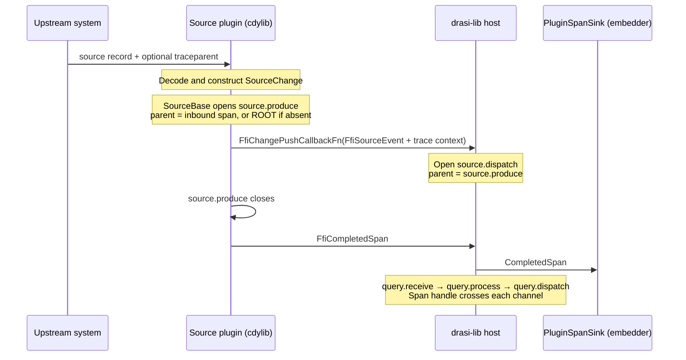
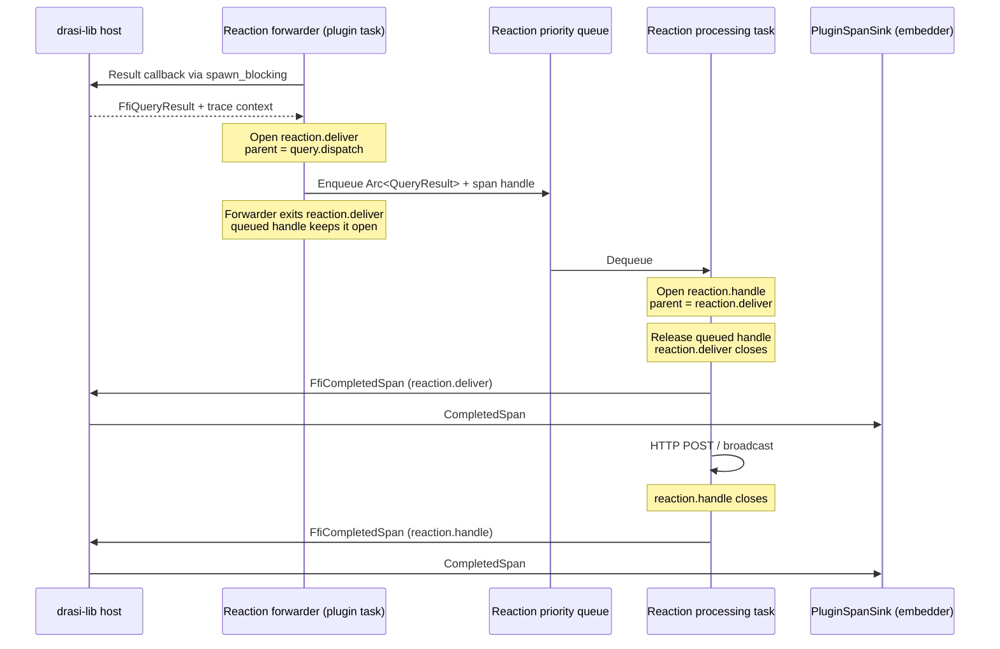
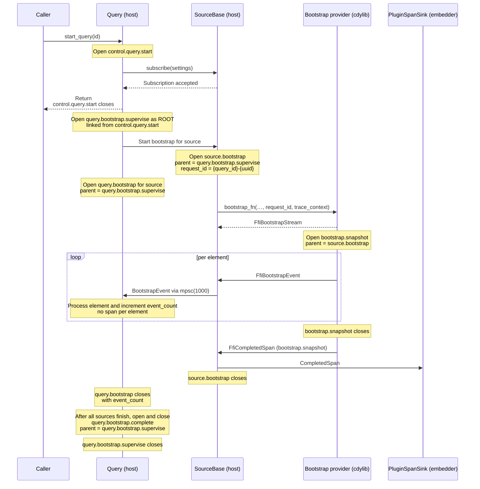
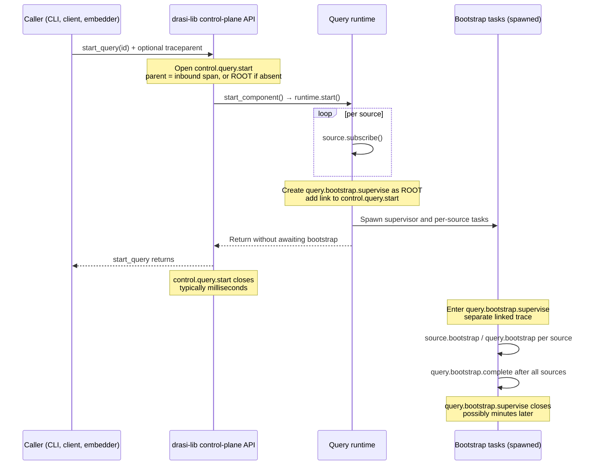
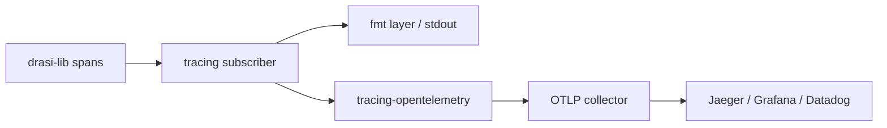

# Tracing for drasi-lib

* Project Drasi - Ruokun Niu (@ruokun-niu)
* Last edited on August 20th, 2026

> Part of the drasi-lib observability design set. Read
> [00 — Overview and Shared Foundations](00-observability-overview.md) first: it defines the facade
> principle, the pipeline model and task/interval labels used below, the plugin FFI transport, the
> naming conventions, and the enablement/profile model. Metrics are covered in
> [02 — Metrics](02-metrics.md).

## Overview

This document defines the spans that trace source changes through the Source -> Query -> Reaction
pipeline. It specifies span names and fields, where traces begin, and how parent context crosses
Tokio tasks, channels, and dynamic-plugin FFI boundaries so each event produces one connected trace
tree.

It also defines framework and plugin-authored spans, how completed dynamic-plugin spans return to
the host for export, and the sampling and lifecycle rules that keep tracing bounded. Existing log
events continue to work and gain the context of the span in which they occur.

## Design

### Tracing a Statically Linked Build

When components are linked as ordinary crates, a
source is registered as a plain trait object — `with_source(impl SourceTrait)`
(`lib/src/builder.rs:395`) — and **no FFI is involved at any point**. One binary, one `tracing`
subscriber, one global `metrics` recorder.

Plugin spans then need no FFI-specific machinery:

| Concern | Static answer |
|---|---|
| Parenting | Ordinary contextual nesting. For example, a reaction's `http.post` span inside the framework-owned `reaction.handle` span nests automatically |
| Getting spans to the backend | They already are there — same subscriber as the host |
| Namespacing | The `tracing` **target** is the plugin's real crate path, e.g. `drasi_source_postgres::replication`. Free, and precise |
| Plugin boundary | There is no FFI boundary |
| Tokio task and channel boundaries | Context does not propagate automatically; the event wrapper carries a `tracing::Span` handle that the receiving task uses as its explicit parent |


The five-task pipeline therefore still needs explicit span handles on `SourceEventWrapper`,
`PriorityQueueEvent`, and `QueryResult`. Static linking removes only the FFI transport; it does not
remove propagation across `tokio::spawn` or channels.

### Tracing a Dynamically Loaded Build

A cdylib plugin has its own Tokio runtime and `tracing` subscriber, so it cannot share live
`tracing::Span` handles with the host. Trace identity crosses the FFI boundary as serialized
`FfiTraceContext`, containing the trace ID, current span ID, and sampling decision.

For source changes, the source plugin creates or adopts the `source.produce` context and attaches it
to `FfiSourceEvent`; the host uses it as the parent of `source.dispatch`.

Context also travels from the host into a plugin when the host sends a query result to a reaction, subscribes a source,
requests a bootstrap snapshot, or calls lifecycle operations such as `start` and `stop`. The plugin
uses the supplied context as the parent of its work. When a plugin span finishes, the plugin returns
it as `FfiCompletedSpan` through `SpanCallbackFn`, and the host forwards it to `PluginSpanSink` for
export.

Tokio task and channel boundaries still require explicit propagation on both sides of the FFI
boundary. Dynamic loading adds serialized FFI transport; it does not replace the in-process span
handles used between tasks.

#### Final FFI trace-context contract

The FFI wire value carries the sender's current trace identity and sampling decision:

```rust
#[repr(C)]
#[derive(Debug, Clone, Copy)]
pub struct FfiTraceContext {
  pub trace_id: [u8; 16],
  pub span_id: [u8; 8],
  pub trace_flags: u8,
}
```

`span_id` becomes the receiver's parent span ID. An all-zero value means no parent context.
Completed plugin spans return through `SpanCallbackFn` using:

```rust
#[repr(C)]
pub struct FfiCompletedSpan {
  pub name: *const c_char,
  pub target: *const c_char,
  pub trace_id: [u8; 16],
  pub span_id: [u8; 8],
  pub parent_span_id: [u8; 8],
  pub trace_flags: u8,
  pub start_time_ns: u64,
  pub end_time_ns: u64,
  pub fields: *const FfiSpanField,
  pub field_count: usize,
}
```

The plugin owns pointer-backed fields only for the duration of the callback, so the host copies
them before returning.

| Boundary | Carrier | Receiver behavior |
|---|---|---|
| Host → plugin call | `FfiTraceContext` parameter | Plugin wrapper creates its boundary span beneath this parent |
| Plugin → host source event | `FfiSourceEvent.trace_context` | Host creates `source.dispatch` beneath `source.produce` |
| Host → plugin query result | `FfiQueryResult.trace_context` | Reaction plugin creates `reaction.deliver` beneath `query.dispatch` |
| Plugin → host completed span | `FfiCompletedSpan` | Host forwards the finished span to `PluginSpanSink` |

### How a Trace Is Assembled

Each pipeline stage creates its own span and identifies the span that caused it as its parent. No
single span wraps the entire Source -> Query -> Reaction pipeline. Across an in-process channel, the
event carries a `tracing::Span` handle for the receiver to use as its parent. Across FFI, where that
handle is not valid, the event or call carries the parent's serialized identity instead. A trace
viewer reconstructs the tree by matching every span's `parent_span_id` to another span's `span_id`.

The `trace_id` groups spans into one trace. Each span has an immutable `span_id`; when it causes the
next stage, that ID becomes the child's `parent_span_id`. Propagating only the trace ID would produce
a flat collection of siblings rather than the Source -> Query -> Reaction hierarchy. The exact FFI
fields and carriers are defined in the
[Final FFI trace-context contract](#final-ffi-trace-context-contract).


### Example Span Flow

#### Source Change flow

The first Drasi span starts inside `SourceBase`; it adopts valid incoming context or roots a new
trace.



The reaction plugin pulls each result from the host. Its internal queue separates delivery from the
actual reaction work:



Two consequences follow, and both matter elsewhere in this document:

- **It is a tree, not a chain.** One change fans out to every subscribed query and each query to its
  reactions, all sharing the trace id — see [Multi-Branch Trace Trees](#multi-branch-trace-trees-fan-out).
  This is also why the sampling flag must be decided at the root and honoured by every branch; if
  some branches sample and others do not, the trace renders with holes.
- **There is no end-to-end wrapper span.** A span remains alive only until its local work and the
  next parent handoff complete. A span handle carried through a queue keeps that parent open during
  the queue wait; it is released after the receiver creates the child span.

#### Bootstrap flow

Bootstrap is a separate host-rooted trace linked from the short control-plane start trace. Context
is injected into the provider plugin through the `bootstrap_fn` call:



#### Control-plane flow

A management call such as `start_query`, `stop_source`, or `add_reaction` gets a short span that
measures the call itself. Long-running work started by the call uses a separate trace.



The control span reports caller latency and may be a child of an inbound trace. The bootstrap
supervisor is always a separate root linked to that control span, so it can outlive the call without
inflating the caller's latency.


#### Cross-source join flow

Each source change keeps its own trace. When an `Orders` change evaluates a join against a
`Customers` row written earlier, `process_source_change()` receives only the Orders change; it reads
the customer row from the query index. The customer event's trace has already ended, so there is no
second live span to merge or link.

The join work is visible in the triggering change's `query.process` duration. Index-specific
latency is reported by `drasi.index.operation.duration`. Drasi does not persist trace context with
indexed elements: that would add permanent storage overhead, and links would usually point to
traces already removed by backend retention.

#### Non-event flow: the future queue

Temporal functions can produce a result without a new external source change. Drasi models the
wake-up mechanism as `FutureQueueSource`, registered under `__future_queue__`, which dispatches
`SourceControl::FuturesDue` when work may be due.

The wake-up signal itself is not traced. It can be emitted repeatedly before an earlier signal is
drained, so tracing every signal would create empty duplicate traces. Instead, each query processor
opens `source.futures_due` as a new root only after its first successful pop. A signal that finds no
due future produces no trace. This yields one trace per non-empty query drain and is the deliberate
exception to the normal rule that a source event opens the trace at dispatch time.

| # | Where | What happens |
|---|---|---|
| 1 | Earlier source change | Evaluation pushes a `FutureElementRef` carrying `element_ref`, `original_time`, and `due_time`. The scheduling trace ends; its context is not stored with the future. |
| 2 | Signaler task | When `peek_due_time()` reports due work, dispatch `FuturesDue` as an untraced wake-up signal. |
| 3 | Query processor | On the first successful pop, open `source.futures_due` with `query_id`, the popped `due_time`, and `lateness_ms = now - due_time`. |
| 4 | Per due future | Open `query.process` beneath the drain root with `trigger=future`, the original `source_id` from `element_ref`, and `pending_ms = due_time - original_time`. |
| 5 | Per result | Reuse normal `query.dispatch` and reaction spans. |
| 6 | End of drain | Record `futures_processed` on the root and close it when the next pop returns `None`. |

```
source.futures_due { source_id=__future_queue__, query_id=q1,        ← root
                     due_time=…, lateness_ms=63, futures_processed=4 }
├── query.process { query_id=q1, source_id=orders-db,               ← the REAL source,
│                   trigger=future, pending_ms=1800000 }              from element_ref
│   └── query.dispatch { added=1 }
│       └── reaction.deliver { reaction_id=webhook }
├── query.process { … }        ← second due future, same drain
└── query.process { … }
```


#### Multi-Branch Trace Trees (Fan-Out)

The source-change flow above shows the simple case: 1 source → 1 query → 1 reaction. The trace tree below shows how a single source event fans out into a **branching trace tree** when multiple queries and reactions are subscribed:

```
source.dispatch { source_id=postgres-src, element_id=Order:42,
                  source.dispatch_id=d-7f3a, chunk_index=0, chunk_count=1 }
├──► query.receive { query_id=q1 }                                        ← fan-out #1: N queries
│    └── query.process { query_id=q1 }
│        └── query.dispatch { query_id=q1, added=1 }
│            ├──► reaction.deliver { reaction_id=webhook }                 ← fan-out #2: M reactions
│            └──► reaction.deliver { reaction_id=logger }
├──► query.receive { query_id=q2 }
│    └── query.process { query_id=q2 }
│        └── query.dispatch { query_id=q2, added=0 }                      ← no results = no reaction spans
└──► query.receive { query_id=q3 }
     └── query.process { query_id=q3 }
         └── query.dispatch { query_id=q3, added=1 }
             └──► reaction.deliver { reaction_id=webhook }                 ← same reaction, different query
```

Changes passed together to `dispatch_events_batch()` share a trace, up to
`max_changes_per_trace`; beyond it the dispatch continues in a sibling trace with the same
`source.dispatch_id` and an incremented `chunk_index`. See
[batch semantics](#per-source-capability).

All branches share the same `trace_id`. `source.produce` is the first Drasi span; it is either a
child of the incoming span or the trace root when no parent exists. In Jaeger this renders as a
single expandable trace tree. When no `tracing::Subscriber` is installed, a disabled `info_span!()`
costs an atomic load and a branch and allocates nothing — near-zero, not literally zero. When a
subscriber is installed, the cost is proportional to the pipeline topology that the user explicitly
configured. Each span is ~200 bytes in a typical subscriber (span name + fields + timestamps).

### Viewing and Exporting Spans

drasi-lib emits through the `tracing` facade; the embedding application installs the subscriber
before constructing `DrasiLib`. This setup prints completed spans locally:

```rust
use drasi_lib::DrasiLib;
use tracing_subscriber::{fmt::format::FmtSpan, prelude::*};

tracing_subscriber::registry()
  .with(drasi_lib::init_component_log_layer())
  .with(tracing_subscriber::fmt::layer().with_span_events(FmtSpan::CLOSE))
  // Add for export: .with(tracing_opentelemetry::layer().with_tracer(tracer))
  .init();

let drasi = DrasiLib::builder().build().await?;
```



The application owns the exporter and must flush it during shutdown. The complete OTLP setup,
dependencies, profiles, and shutdown notes are in
[Enabling Telemetry as a drasi-lib Consumer](00-observability-overview.md#enabling-telemetry-as-a-drasi-lib-consumer).

### Span Naming and Namespacing

The tables below are the complete inventory of span names this design currently proposes. This is open to discussion for additional spans.

#### Host data plane

| Span | Emitted by | Frequency | Key fields |
|---|---|---|---|
| `source.dispatch_batch` | Source fan-out (T1) | Once per batch, batch path only | `source_id`, `event_count`, `lock_wait_us` |
| `source.dispatch` | Source fan-out (T1) | Once per source change | `source_id`, `op`, `label`, `element_id`, `subscriber_count`, `presend_wait_us`, `postsend_wait_us` |
| `source.subscriber_send` | Source fan-out (T1) | Once per subscribed query per change | `query_id`, `subscriber_index`, `suppressed` |
| `query.receive` | Query forwarder (T2) | Once per query branch | `source_id`, `query_id` |
| `query.process` | Event processor (T3) | Once per change and query; once per due future | `query_id`, `source_id`, optional `trigger`, `pending_ms` |
| `query.dispatch` | Event processor (T3) | Once per processed query branch | `query_id`, `added`, `updated`, `deleted` |
| `source.futures_due` | Future-queue drain | Once per non-empty drain | `source_id`, `query_id`, `due_time`, `lateness_ms`, `futures_processed` |

#### Bootstrap

| Span | Emitted by | Frequency | Key fields |
|---|---|---|---|
| `query.bootstrap.supervise` | Query bootstrap supervisor | Once per query bootstrap; trace root | `query_id`, `source_count` |
| `source.bootstrap` | Source bootstrap task | Once per (query, source) | `source_id`, `query_id`, `request_id` |
| `query.bootstrap` | Query bootstrap consumer | Once per (query, source) | `query_id`, `source_id`, `request_id`, `event_count` |
| `query.bootstrap.complete` | Query bootstrap supervisor | Once when all sources complete | `query_id`, `source_count` |

#### Control plane

Mutating operations use the closed family `control.<component>.<operation>`:

| Components | Operations | Examples | Key fields |
|---|---|---|---|
| `query`, `source`, `reaction` | `add`, `start`, `stop`, `remove`, `update` | `control.query.start`, `control.source.add`, `control.reaction.stop` | The component id; `plugin_kind` where applicable |

#### Plugin and FFI boundary spans

| Span | Emitted by | Frequency | Phase |
|---|---|---|---|
| `source.produce` | Source plugin base | Automatically once per `dispatch_event()` or bounded `dispatch_events_batch()` chunk; root only when no inbound context exists | 1 |
| `source.subscribe` | Source plugin base | Once per subscription call | 1 |
| `bootstrap.snapshot` | Bootstrap provider plugin | Once per `BootstrapRequest` | 1 |
| `reaction.deliver` | Reaction plugin forwarder | Once per result pulled and enqueued | 1 |
| `reaction.handle` | Reaction plugin processor | Once per dequeued result | 1 |
| `identity.resolve` | Identity-provider boundary | Once per credential resolution | 2 |
| `secret.fetch` | Secret-store boundary | Once per secret lookup | 2 |
| `plugin.bootstrap` | Generated bootstrap FFI wrapper | Once per `bootstrap_fn` call | 1 |


Names follow the convention in [Span Naming and Namespacing](#span-naming-and-namespacing):
lowercase, dot-separated, no `drasi.` prefix (because span names are not global identifiers like metric names), and no unit suffixes. Identity stays in fields rather
than the span name. Spans that bracket a plugin call also carry `plugin_kind`, read from
`Source::type_name()` or `Reaction::type_name()`.

### Standard Spans for Component Plugins

Plugin tracing has three tiers: host-emitted boundary spans, standard spans for each plugin kind,
and spans added by the plugin author. The catalogue above lists the complete proposed names; this
section explains who emits them and what each tier guarantees.

This tracing contract covers sources, reactions, bootstrap providers, identity providers, and
secret stores. Index, state-store, and WAL operations are high-frequency in-process calls; their
automatic operation counts, latency, and errors are metrics defined in
[02 — Metrics](02-metrics.md#83-tier-2--the-per-kind-standard-set), not standard spans.

**A new plugin author implements none of Tier 1 or Tier 2.** Those tiers are part of Drasi's host
and SDK contract and appear automatically when the plugin implements its normal interface:

| Tier | Owner | Plugin-author action |
|---|---|---|
| Tier 1 | drasi-lib host wrappers | None |
| Tier 2 | `drasi-plugin-sdk` wrappers and shared base types | None beyond using the normal SDK interface |
| Tier 3 | Plugin author | Optional custom spans for plugin-specific work |

#### Tier 1 — universal baseline, emitted by the host

The host wraps each plugin call that performs real work. The available calls differ by plugin kind,
but the mechanism is the same. A plugin author does not add annotations, tracing calls, or wrapper
code to receive Tier 1 spans.

| Plugin kind | Example host-wrapped calls | What the Tier 1 span measures |
|---|---|---|
| Source | `initialize_fn`, `start_fn`, `subscribe_fn`, `stop_fn` | Time spent entering or controlling the source plugin |
| Reaction | `initialize_fn`, `start_fn`, `stop_fn`, `deprovision_fn` | Time spent in the reaction lifecycle call |
| Bootstrap provider | `bootstrap_fn` | Time until the provider accepts the request and returns its stream |
| Identity provider | `get_credentials_fn` | Credential-resolution latency and failure, planned for Phase 2 |
| Secret store | `get_secret_fn` | Secret-lookup latency and failure, planned for Phase 2 |

Each span records the operation, component id, `plugin_kind`, duration, and success or error. It
does not expose plugin-internal steps; those belong to Tier 2 and Tier 3.

#### Tier 2 — per-kind standard spans, emitted automatically by the SDK

Tier 2 splits that block along the boundaries that matter for each kind of plugin. These spans are
framework instrumentation inside the plugin library: plugin authors do not call `tracing`, open the
spans, or propagate their context.

These are emitted by the shared base types — `SourceBase`, `ReactionBase` and their siblings — and
that placement is what makes the guarantee hold: **`drasi-plugin-sdk` depends on `drasi-lib`
(`plugin-sdk/Cargo.toml`), so a cdylib plugin links its own copy of those base types.** The same
code emits the same spans whether a component is statically linked or loaded as a `.so`. A plugin
author gets them by implementing the normal SDK interface and using its existing base types. If a
plugin kind lacks the required shared wrapper or base type, Drasi must add that support to the SDK;
the plugin author must not reimplement the standard span. This is the same structural argument the
metrics tiering rests on.

| Plugin kind | Standard spans | Covers |
|---|---|---|
| **Source** | `source.produce` | Framework dispatch of completed `SourceChange`(s). Adopts valid inbound context or roots a new trace — see [Trace Rooting](#trace-rooting-and-lifetimes) |
| | `source.subscribe` | The host's subscribe call, including bootstrap setup |
| **Bootstrap provider** | `bootstrap.snapshot` | One per `BootstrapRequest`, tagged `request_id`. **Not per element** — see [Bootstrap flow](#bootstrap-flow) |
| **Reaction** | `reaction.deliver` | Pull from the host through to enqueue |
| | `reaction.handle` | Dequeue through to completion — the actual outbound work |
| **Identity provider** | `identity.resolve` | One credential resolution, usually network I/O |
| **Secret store** | `secret.fetch` | One secret lookup |

#### Tier 3 — the author's own spans

Tier 3 is optional. Authors use ordinary `tracing::info_span!()` only when they want visibility into
plugin-specific work. These spans nest under a Tier 2 span when they execute inside a
framework-owned callback, cross FFI through the same export path, and need no registration or
declaration. Source polling and decoding happen before `dispatch_event()`, so those optional author
spans cannot be children of the later automatic `source.produce` span.

**Source plugin.** The shape below follows the real Kafka consumer loop
(`components/sources/kafka/src/consumer.rs:184`). The source contains no tracing code. The call to
`dispatch_event()` opens and closes `source.produce` inside `SourceBase`:

```rust
while let Some(msg) = stream.next().await {
  let payload: JsonValue = serde_json::from_slice(msg.payload().unwrap_or_default())?;
  let change = self.engine.apply(&payload).await?;

  // SourceBase opens `source.produce`, adopts attached inbound context when
  // present, writes its context onto the envelope, dispatches, and closes.
  self.base.dispatch_event(SourceEventWrapper::new(change)).await?;
}
```

Producing:

```
[optional upstream span]
└── source.produce { source_id=orders-kafka }    ← automatic tier 2; root if no upstream
  └── source.dispatch { … }                    ← host, child of source.produce
```

Context-capable adapters such as HTTP and Kafka must still extract `traceparent` from their
protocol and attach the parsed context to `SourceEventWrapper`. That is transport propagation, not
span instrumentation; the adapter never creates `source.produce` itself.

**Reaction plugin.** Nothing to open at all — tier 1 and tier 2 already bracket the call
(`reaction.deliver` at the FFI edge, `reaction.handle` around the author's processing function, the
shape of `components/reactions/http/src/process.rs:210`). The author only marks the interesting
sub-steps:

```rust
pub(crate) async fn process_result(&self, result: QueryResult) -> Result<()> {
    // Already running inside `reaction.handle` — no setup required.
    let body = info_span!("payload.render", diffs = result.diffs.len())
        .in_scope(|| self.template.render(&result))?;

    self.client
        .post(&self.url)
        .body(body)
        .send()
        .instrument(info_span!("http.post", url = %self.url))
        .await?;

    Ok(())
}
```

### Trace Rooting and Lifetimes

#### Per-source capability

Every source can operate without inbound context. What varies is whether its protocol can carry a
W3C parent and whether the adapter extracts it before calling `SourceBase`:

| Source | Can adopt an upstream trace? | Status today |
|---|---|---|
| HTTP (`components/sources/http`) | **Yes** — W3C `traceparent` header | Already receives `axum::http::HeaderMap` (`src/lib.rs:717`) and already reads headers for HMAC verification and template context. Extracting `traceparent` is a small change |
| gRPC | **Yes** — W3C `traceparent` in request metadata | Extract `traceparent` from gRPC metadata and convert it to `FfiTraceContext` before calling `SourceBase` |
| Kafka (`components/sources/kafka`) | **Yes** — W3C context in message headers | **Not read today.** `consumer.rs:100` reads only `msg.key()` and `msg.payload()`; `msg.headers()` is never called |
| Database CDC (Postgres, MySQL, MSSQL, …) | No | The change is observed from a replication log with no room for caller context, so `source.produce` roots a new trace |


When a batch carries inbound context, only changes with the same parent context share a chunk.
Different parents are split before the size cap is applied.

| Field on each chunk's `source.produce` span | Meaning |
|---|---|
| `source.dispatch_id` | Identical across every chunk of one `dispatch_events_batch()` call. This makes the chunks re-joinable with one backend query |
| `chunk_index`, `chunk_count` | Position and total. `chunk_count` is known at dispatch time — `dispatch_events_batch` takes an already-materialized `Vec<SourceEventWrapper>` (`lib/src/sources/base.rs:1305`), and request/message-driven sources likewise know their change count before dispatching |


### Retrospective Spans

Retrospective spans are deferred. Supporting them later requires:

1. Source plugins to populate origin and reactivator timestamps in `ProfilingMetadata`.
2. Those timestamps to survive static and FFI event transport without changing clock domains.
3. drasi-lib to convert completed intervals into backdated `SpanData` through the same export path
  used by `PluginSpanSink`.
4. Tests that verify parentage, timestamps, and behavior when metadata is missing or clocks are
  inconsistent.
5. An opt-in observability profile because adding channel and queue-wait spans substantially
  increases span volume.

Until these prerequisites exist, pre-dispatch latency remains a metrics concern rather than a
trace span.

## Supportability

### Verification

| Test | Scope | Approach |
|------|-------|----------|
| Span creation | Unit | Use `tracing_subscriber::fmt::TestWriter` or `tracing-test` crate to assert that expected spans are created with correct fields when processing a mock source change |
| Trace connectivity | Unit | Push an event through a mock pipeline and assert all spans share one `trace_id` with the expected parent-child nesting across task boundaries |
| End-to-end with OTLP | Manual / Integration | Example app with `tracing-opentelemetry` + Jaeger; verify spans appear in Jaeger UI with correct nesting and fields |
| Inbound trace parent | Integration | Supply an external `traceparent` at a source and assert `source.produce` keeps its `trace_id`, creates a new span id, and records the external span id as its parent |
| Plugin span nesting | Integration | Load a cdylib plugin that emits its own span; assert it is exported under the pipeline `trace_id` with the host span as parent |
| Head-of-line blocking at fan-out | Integration | Subscribe several queries, saturate one subscriber's channel, and assert the `source.subscriber_send` spans for subscribers *behind* it show the stall — this is the failure the span exists to expose |
| Batch dispatch shape | Integration | Drive a source that uses `dispatch_events_batch` (Oracle or MSSQL) and assert every per-event `source.dispatch` parents under one `source.dispatch_batch`, with the batch-entry lock wait on the parent rather than reading ≈0 on each child |
| Dispatch batch shares one trace | Integration | Pass several changes to `dispatch_events_batch()`, below the cap, and assert every change lands in one `trace_id` carrying a common `source.dispatch_id` |
| Cap splits, and links back | Integration | Pass `max_changes_per_trace + 1` changes to `dispatch_events_batch()`; assert exactly two traces, `chunk_count = 2`, matching `source.dispatch_id`, and that chunk 1 links to chunk 0 — to the *first* chunk, not a chain |
| Sampling is per dispatch batch, not per chunk | Integration | Without inbound context and with sampling below 1.0, dispatch a batch spanning several chunks repeatedly; assert every chunk of a given batch is either wholly sampled or wholly dropped |
| Control-plane span does not absorb bootstrap | Integration | Call `start_query()` on a query with a slow source and assert `control.query.start` closes in milliseconds while `query.bootstrap.supervise` runs on as a separate linked root — the caller's latency must not be inflated by the snapshot |
| Control plane adopts inbound context | Unit | Supply a `traceparent` to a control-plane op and assert the span keeps its trace id and records its span id as parent, matching the source-path rule |
| Bootstrap span count is element-independent | Integration | Bootstrap a query from two sources with 10 elements, then with 100,000; assert both produce the same number of spans (`3 + 4N_sources`) and that `event_count` differs. This pins the bound against a well-meaning per-element span being added later |
| Join does not merge traces | Integration | Run a query joining two sources; write to source B, then to source A so the A change joins against B's stored row. Assert the two changes produce **two separate `trace_id`s**, and that A's trace contains no span or link referring to B's earlier event |
| Empty future wake-up produces no trace | Integration | Dispatch `FuturesDue` when a query has no due future; assert no `source.futures_due` span is emitted |
| Future drain trace shape | Integration | Queue several due futures for one query, dispatch `FuturesDue`, and assert one `source.futures_due` root with one `query.process` child per popped future, the expected `futures_processed`, and no link to the scheduling traces |

Security, compatibility impact, and the shared verification checks are covered in
[00 — Overview](00-observability-overview.md).


## References

- [`tracing` crate](https://crates.io/crates/tracing) — Structured diagnostics facade for Rust
- [drasi-platform query-host](https://github.com/drasi-project/drasi-platform/tree/main/query-container/query-host) — Reference implementation of OpenTelemetry tracing in Drasi
- [drasi-platform query-host `init_tracer()`](https://github.com/drasi-project/drasi-platform/blob/main/query-container/query-host/src/main.rs) — Existing OTLP setup pattern used in Drasi for Kubernetes
