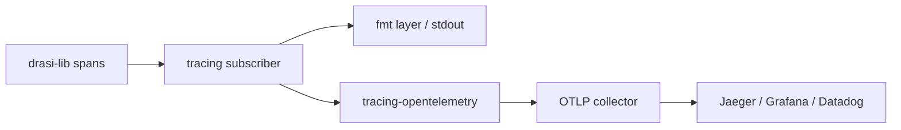
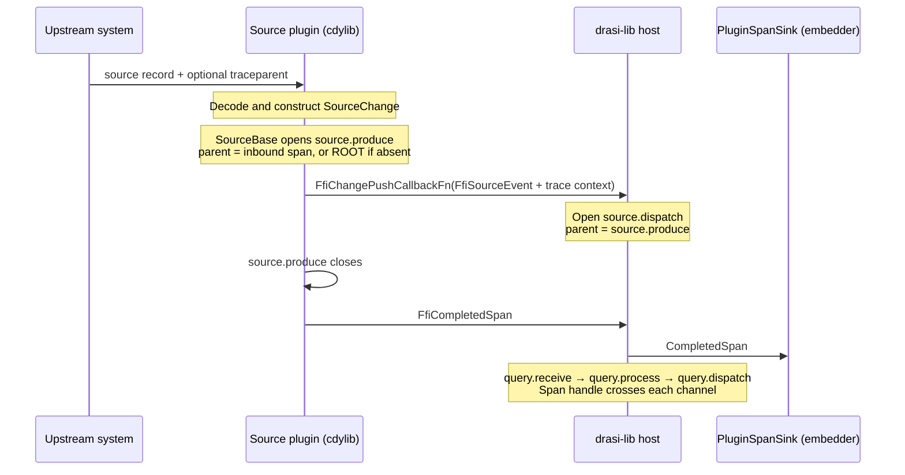
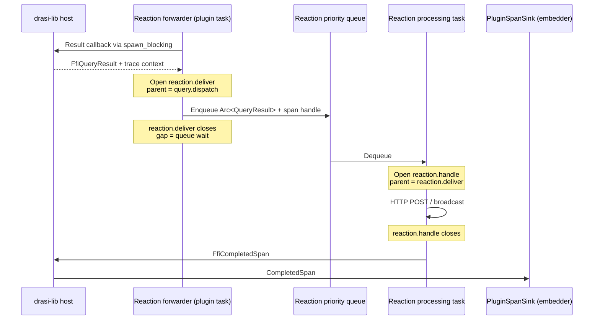
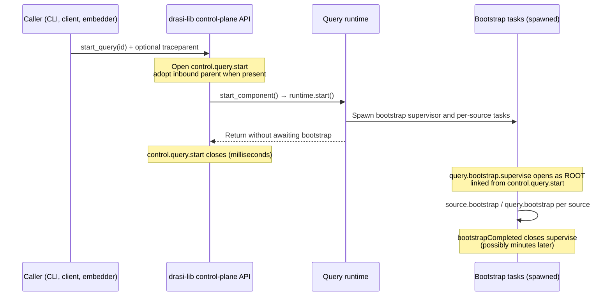

# Tracing for drasi-lib

* Project Drasi - Ruokun Niu (@ruokun-niu)
* Last edited on August 19th, 2026

> Part of the drasi-lib observability design set. Read
> [00 — Overview and Shared Foundations](00-observability-overview.md) first: it defines the facade
> principle, the pipeline model and task/interval labels used below, the plugin FFI transport, the
> naming conventions, and the enablement/profile model. Metrics are covered in
> [02 — Metrics](02-metrics.md).

## Overview

This document defines structured `tracing` spans that wrap those existing log events to add
duration, causality, and nesting:

```
TRACE [0.8ms] source.dispatch { source_id=postgres-src, op=insert, label=Order, element_id=Order:42 }
  └── TRACE [0.1ms] query.receive { source_id=postgres-src, query_id=q1 }
        └── TRACE [45.3ms] query.process { query_id=q1, source_id=postgres-src }
              ├── [INFO] Processing source change      ← existing log event, now inside a timed span
              └── TRACE [3.1ms] query.dispatch { query_id=q1, added=1 }
                    └── TRACE [1.2ms] reaction.receive { reaction_id=webhook, query_id=q1 }
```

The existing log events continue to work — they just now appear inside spans that provide timing context and cross-component causality.

### Viewing and Exporting Spans

drasi-lib emits through the `tracing` facade; the embedding application installs the subscriber
before constructing `DrasiLib`. This setup prints completed spans locally:

```rust
use drasi_lib::DrasiLib;
use tracing_subscriber::{fmt::format::FmtSpan, prelude::*};

tracing_subscriber::registry()
  .with(drasi_lib::init_component_log_layer())
  .with(tracing_subscriber::fmt::layer().with_span_events(FmtSpan::CLOSE))
  // Add for export: .with(tracing_opentelemetry::layer().with_tracer(tracer))
  .init();

let drasi = DrasiLib::builder().build().await?;
```



The application owns the exporter and must flush it during shutdown. The complete OTLP setup,
dependencies, profiles, and shutdown notes are in
[Enabling Telemetry as a drasi-lib Consumer](00-observability-overview.md#enabling-telemetry-as-a-drasi-lib-consumer).

## Design

### Tracing a Statically Linked Build

 When components are linked as ordinary crates, a
source is registered as a plain trait object — `with_source(impl SourceTrait)`
(`lib/src/builder.rs:395`) — and **no FFI is involved at any point**. One binary, one `tracing`
subscriber, one global `metrics` recorder.

Plugin spans then need no design at all:

| Concern | Static answer |
|---|---|
| Parenting | Ordinary contextual nesting. For example, a reaction's `http.post` span inside the framework-owned `reaction.handle` span nests automatically |
| Getting spans to the backend | They already are there — same subscriber as the host |
| Namespacing | The `tracing` **target** is the plugin's real crate path, e.g. `drasi_source_postgres::replication`. Free, and precise |
| Trace context across the boundary | There is no boundary |

So a statically linked deployment needs **none** of the three FFI carriers, no `FfiCompletedSpan`,
and no `PluginSpanSink` — which means [Requirement 1](00-observability-overview.md#requirements)
holds with no exception at all. Everything from [Plugin Spans](#plugin-spans) onward is machinery
for reproducing, over a C ABI, what a single binary gets for free.

> ⚠️ **What static does *not* make easy: the channel hops.** `tracing` does not propagate across
> `tokio::spawn` or a channel even inside one process, so the five-task pipeline still needs explicit
> span handles on `SourceEventWrapper`, `PriorityQueueEvent` and `QueryResult`. That is Phase 0 work
> and is entirely unaffected by build mode. It is a common and costly assumption that FFI is what
> breaks span propagation; **task boundaries break it first** — which is what the next section is
> about.

### How a Trace Is Assembled

Everything in this document rests on one mechanism, and the rest reads more easily once it is
stated plainly: **a span never travels. Only its identity does.**

Each component creates its *own* span, records the identity of the span it hangs under, finishes it,
and exports it independently. Nothing is held open across the pipeline waiting for downstream work
to finish. The tree you see in a trace viewer is reconstructed by the backend afterwards, by
matching each span's recorded parent to some other span's id.

So at every boundary the only question is *what physically moves*, and the answer is always these
three values:

| Value | Size | Changes along the way? | Purpose |
|---|---|---|---|
| `trace_id` | 16 bytes | No — set once at the root | Groups every span into one trace |
| `span_id` — the **sender's own current span** | 8 bytes | **Yes, rewritten at every hop** | Becomes the receiver's `parent_span_id`. This is what produces nesting |
| `flags` | 1 byte | No — set at the root | Sampling decision |

`trace_id` decides
*which trace* a span belongs to; `parent_span_id` decides *where in the tree* it sits. Propagating
only the `trace_id` produces one trace containing a flat pile of siblings — you would know the spans
were related, but not that `reaction.handle` happened *because of* `query.dispatch`, and the waterfall
would be gone.

#### Three kinds of boundary, three carriers

A change crosses three structurally different boundaries on its way through Drasi, and each one
admits a different carrier:

| Boundary | What moves | Why not something cheaper |
|---|---|---|
| Across FFI, on a **data** event | `FfiTraceContext` in `FfiSourceEvent.trace_context` or `FfiQueryResult.trace_context` | A `tracing::Span` handle is bound to the subscriber that created it and is meaningless in the other library's address space. Applies in **both** directions — the data plane has no calls to hang parameters on |
| Across FFI, on a **call** | `FfiTraceContext` as a call parameter | Where a real function call exists — bootstrap, identity provider, secret store — there is a parameter to add |
| Host task → host task (channel) | An actual `tracing::Span` handle on the event wrapper | Same process, same subscriber — the real handle is cheaper than re-parsing ids, and keeps the parent alive until the child is created |

The split is not arbitrary: **the data plane moves events, never calls.** Source changes are pushed
by the plugin, and query results are *pulled* by the reaction plugin's own forwarder
(`vtable_gen.rs:1561`) — in neither case does the host make a call it could attach a parameter to.
Mechanics and current implementation status for the FFI rows are in
[Current SDK gaps](#current-sdk-gaps).

#### Connected hierarchy across host tasks

Inside the host, the pipeline crosses five independent Tokio tasks connected by
`ChangeDispatcher` and `PriorityQueue` channels. `tracing` does not propagate context across those
boundaries automatically: without an explicit carrier, each task would create an unrelated root.

The sender therefore places a lightweight `tracing::Span` handle beside the event. The receiver
uses it as the **explicit parent** of its own span (`info_span!(parent: &carried_span, ...)`) before
passing a handle to the next task. This uses parent-child relationships rather than `follows_from`:
the handle keeps the parent alive long enough for the child to record its span id, producing one
connected tree instead of loose causal links.

The source and reaction diagrams below show this connected hierarchy. Gaps between adjacent spans
are time spent in channels and queues. The concrete wrapper fields that carry these handles are specified in
[Trace Context Propagation Across Channels](#trace-context-propagation-across-channels).

#### Source Change flow

The first Drasi span starts inside `SourceBase`; it adopts valid incoming context or roots a new
trace.



The reaction plugin pulls each result from the host. Its internal queue separates delivery from the
actual reaction work:



Two consequences follow, and both matter elsewhere in this document:

- **It is a tree, not a chain.** One change fans out to every subscribed query and each query to its
  reactions, all sharing the trace id — see [Multi-Branch Trace Trees](#multi-branch-trace-trees-fan-out).
  This is also why the sampling flag must be decided at the root and honoured by every branch; if
  some branches sample and others do not, the trace renders with holes.
- **Nothing stays open.** Each span closes as soon as its own work is done, which is what makes the
  scheme safe for an unbounded streaming pipeline — and is precisely the property the long-lived
  universal parent span destroyed in an earlier Drasi deployment.

#### Bootstrap flow

Bootstrap is a separate host-rooted trace linked from the short control-plane start trace. Context
is injected into the provider plugin through the `bootstrap_fn` call:

```mermaid
sequenceDiagram
  participant C as Caller
  participant Q as Query (host)
  participant S as SourceBase (host)
  participant BP as Bootstrap provider (cdylib)
  participant SK as PluginSpanSink (embedder)

  C->>Q: start_query(id)
  Note over Q: Open control.query.start
  Q->>S: subscribe(settings) · source.subscribe
  Q-->>C: Return; control.query.start closes
  Note over Q: Open query.bootstrap.supervise as ROOT<br/>linked from control.query.start
  Note over S: Open source.bootstrap<br/>request_id = {query_id}-{uuid}
  S->>BP: bootstrap_fn(…, request_id, trace_context)
  BP-->>S: FfiBootstrapStream
  Note over BP: Open bootstrap.snapshot<br/>parent = source.bootstrap
  loop per element
    BP->>S: FfiBootstrapEvent
    S->>Q: BootstrapEvent via mpsc(1000)
  end
  Note over BP: bootstrap.snapshot closes
  BP->>S: FfiCompletedSpan
  S->>SK: CompletedSpan
  Note over Q: query.bootstrap per source<br/>bootstrapCompleted closes query.bootstrap.supervise
```

#### Control-plane flow

A management call — `start_query`, `stop_source`, `add_reaction`. The one place in Drasi where
`tracing` behaves the way its documentation implies, because a caller is on the stack:



The two roots are deliberate: one reports caller latency, while the other reports bootstrap
duration.


#### Cross-source join flow

| # | When | What happens |
|---|---|---|
| 1 | `10:00:01` | A `Customers` change arrives. Trace **X** is minted at the source, runs the full pipeline, closes and exports. The customer row lands in the query's index |
| 2 | — | Minutes, days or weeks pass. Trace X has long since been exported, and may have aged out of the backend entirely |
| 3 | `10:04:37` | An `Orders` change arrives. Trace **Y** is minted at *its* source, with no relationship to X — the source has no idea a join is downstream |
| 4 | Host, `query.process` | `process_source_change()` takes **one** `SourceChange` (`continuous_query.rs:105`). To evaluate the join it *reads the customer row from the index* — there is no second event, and nothing live to attach to |
| 5 | Host | The join's cost appears as **duration on `query.process`**, not as a span from the other source |
| 6 | Backend | Two independent traces. Y contains **no span and no link** referring to X |

> **The rule this illustrates: a trace follows one event; a join reads *state*, and state has no
> trace.** A join partner contributed *data*, not *latency*. Why persisting trace context in the
> index and emitting a link was rejected — and what is observable instead — is in
> [Multi-Source Queries](#multi-source-queries-a-join-does-not-join-two-traces).

#### Non-event flow: the future queue

The hardest case, because **nothing arrives**. Temporal functions — `drasi.trueFor`,
`trueUntil`, `trueLater`, `trueNowOrLater` (`core/src/evaluation/functions/future/`) — schedule a
re-evaluation for a future instant. When that instant arrives with no source change to trigger it,
the query result changes anyway. *"Order 42 has been unshipped for 30 minutes"* is a result nobody
sent an event about.

**Verified: this is already modelled as a source.** `FutureQueueSource`
(`lib/src/sources/future_queue_source.rs:30`) registers under the reserved id
`__future_queue__` and dispatches an ordinary `SourceEventWrapper` carrying
`SourceEvent::Control(SourceControl::FuturesDue)`. So the rooting rule needs no exception — **the
source still roots the trace**, it just happens to be a clock rather than a database.

| # | Where | What happens |
|---|---|---|
| 1 | Earlier — any change | Evaluating `trueFor` pushes a `FutureElementRef` onto the queue (`future_queue.rs:30`) carrying `element_ref`, `original_time`, `due_time`, `group_signature`. **That change's trace closes and exports here.** Nothing stays open |
| 2 | Signaler task | The polling loop `peek_due_time()`s — never pops (`future_queue_source.rs:123`). Not due yet → sleeps `min(due − now, 5000)`ms. Empty queue → sleeps 100 ms |
| 3 | Signaler task | Due. Dispatches `FuturesDue`, stamped with the **`due_time`**, then throttles 50 ms before peeking again |
| 4 | Query processor | Receives the signal and **drains in a loop** until `process_due_futures()` returns `None` (`manager.rs:2221`). One signal, *N* futures |
| 5 | Per future | `process_due_futures()` pops **one** item, wraps it as `SourceChange::Future { future_ref }`, and runs it through **the same** `process_changes_inner()` a real change uses (`continuous_query.rs:154`) |
| 6 | Per future | Results dispatch through `dispatch_query_results()` exactly as normal — outbox, live results, reactions. Downstream cannot tell a non-event from an event, and should not have to |

**DECIDED — root at the future-queue source; one trace per *drain*, one `query.process` per due
future.** This resolves the open question previously recorded here.

```
source.futures_due { source_id=__future_queue__, query_id=q1,        ← root
                     due_time=…, lateness_ms=63, futures_processed=4 }
├── query.process { query_id=q1, source_id=orders-db,               ← the REAL source,
│                   trigger=future, pending_ms=1800000 }              from element_ref
│   └── query.dispatch { added=1 }
│       └── reaction.receive { reaction_id=webhook }
├── query.process { … }        ← second due future, same drain
└── query.process { … }
```

Three things this gets right that the obvious design does not.

**1. The root opens on the first successful pop, not on signal receipt.** The signaler only
*peeks*, and re-peeks 50 ms after dispatching — so it will happily re-signal an item the processor
has not drained yet. **Spurious `FuturesDue` signals are expected, not exceptional.** Spanning the
signal would emit an empty trace every 50 ms under load, which is worse than no instrumentation.
Opening lazily costs the signal-to-first-pop interval as a *span*, but not as *data*: the wrapper
is stamped with `due_time`, so `now − due_time` at drain start gives `lateness_ms` — total
scheduler lag including transit, in one field.

**2. `lateness_ms` is the number this whole section exists to expose.** A `trueFor(5 minutes)`
alert is a promise about *when*, and the loop sleeps in capped 5 s slices with a 50 ms throttle —
so lateness is structurally non-zero and grows under load. Nothing measures it today. It belongs
on the root because it is a property of the *drain*, not of any one future.

**3. `pending_ms = due_time − original_time` is recorded, but there is no link to the trace that
scheduled it.** `FutureElementRef` carries `original_time`, so the *duration* the condition was
pending is knowable — but the trace that pushed the future closed at step 1 and has very likely
aged out of the backend. This is the [join rule](#cross-source-join-flow) a third time: **a
scheduled future is state, and state has no trace.** Recording `original_time` as a field is free
and useful; manufacturing a dangling span link to a deleted trace is neither.

**Reused, not new:** `query.process` and `query.dispatch` are the
[canonical spans](#canonical-span-names) — a due future adds `trigger=future` and `pending_ms` to a
span that already exists. Only `source.futures_due` is new, and it is **one per drain**, not per
future.

⚠️ **Never sample this path on volume grounds.** Future-driven results are rare by construction and
are exactly what an operator investigates when an alert fired late or not at all — the same
argument that exempts [the control plane and bootstrap](#open-issues).

**Already half-instrumented.** `process_due_futures()` carries
`#[tracing::instrument(skip_all, err, level = "debug")]` (`continuous_query.rs:153`) and the polling
task is already wrapped in `tracing::info_span!("future_queue_polling", component_id, component_type)`
(`future_queue_source.rs:105`). Both are drasi-core / drasi-lib spans that exist today; this design
gives them a parent and a name that matches the convention.


#### Multi-Branch Trace Trees (Fan-Out)

The diagram above shows the simple case: 1 source → 1 query → 1 reaction. The trace tree below shows how a single source event fans out into a **branching trace tree** when multiple queries and reactions are subscribed:

```
source.dispatch { source_id=postgres-src, element_id=Order:42,
                  source.dispatch_id=d-7f3a, chunk_index=0, chunk_count=1 }
├──► query.receive { query_id=q1 }                                        ← fan-out #1: N queries
│    └── query.process { query_id=q1 }
│        └── query.dispatch { query_id=q1, added=1 }
│            ├──► reaction.receive { reaction_id=webhook }                 ← fan-out #2: M reactions
│            └──► reaction.receive { reaction_id=logger }
├──► query.receive { query_id=q2 }
│    └── query.process { query_id=q2 }
│        └── query.dispatch { query_id=q2, added=0 }                      ← no results = no reaction spans
└──► query.receive { query_id=q3 }
     └── query.process { query_id=q3 }
         └── query.dispatch { query_id=q3, added=1 }
             └──► reaction.receive { reaction_id=webhook }                 ← same reaction, different query
```

Changes passed together to `dispatch_events_batch()` share a trace, up to
`max_changes_per_trace`; beyond it the dispatch continues in a sibling trace with the same
`source.dispatch_id` and an incremented `chunk_index`. See
[batch semantics](#per-source-capability).

All branches share the same `trace_id`. `source.produce` is the first Drasi span; it is either a
child of the incoming span or the trace root when no parent exists. In Jaeger this renders as a
single expandable trace tree. When no `tracing::Subscriber` is installed, a disabled `info_span!()`
costs an atomic load and a branch and allocates nothing — near-zero, not literally zero. When a
subscriber is installed, the cost is proportional to the pipeline topology that the user explicitly
configured. Each span is ~200 bytes in a typical subscriber (span name + fields + timestamps).

#### Multi-Source Queries: a join does not join two traces

A query subscribed to several sources is the obvious place to expect two traces to meet. **They
never do**, and the reason is worth stating because the intuition is strong and wrong.

`ContinuousQuery::process_source_change()` takes **one** `SourceChange`
(`core/src/query/continuous_query.rs:105`), serialized behind a `change_lock`. Whatever else the
query needs to evaluate a join, it reads from its **indexes**. Take a query joining `Orders` and
`Customers`: when an `Orders` change arrives, the matching customer row does not arrive with it —
it has been sitting in the index since whenever that customer was last written. Minutes ago, last
week, or during bootstrap.

Both sources produce traces. What they do not do is produce a *shared* one:

```
10:00:01  Customers change  →  trace X   source.dispatch → query.receive → query.process → …
10:04:37  Orders change     →  trace Y   source.dispatch → query.receive → query.process → …
10:04:39  Orders change     →  trace Z   …
```

Trace Y's `query.process` reads the row trace X wrote three minutes earlier — by which time X has
closed and been exported. There is nothing live to attach to. So the trace shape for a join query is
identical to the single-source shape, and the join partner appears **nowhere in it**: it
contributed data, not latency.

> **The general rule: a trace follows one event through the pipeline. A join reads *state*, and
> state has no trace** — it is the residue of events whose traces already ended.

##### Why not store trace context in the index and emit a link

The mechanically obvious alternative is to persist the writing event's trace context alongside each
element, then attach a span link when the element is read. Rejected on two counts:

| | |
|---|---|
| **Cost is permanent** | 25 bytes on every element in every index, persisted, to support one link |
| **The link would usually dangle** | Trace backends retain for days; index elements live indefinitely. A link from today's order to a customer row written three weeks ago resolves to a trace that was deleted long ago. **A dangling link is worse than no link** — it reads as data loss rather than as expected behaviour |

This is the same reasoning that rules out
[retrospective spans](#retrospective--historical-spans--to-be-discussed): do not manufacture trace
structure for events whose traces are gone.

##### What is observable across sources instead

- **`query.process` duration already includes the index lookups**, so a slow join shows up as a slow
  `query.process`. Attributing it to the index specifically is a metrics question —
  `drasi.index.operation_duration_seconds` labelled by `query_id`
  ([02 — Metrics A.10](02-metrics.md#a10-storage-index-state-store-and-wal)) — not a trace one.
- **Bootstrap is the one time both sources appear in a single trace.** The bootstrap tree roots at
  `query.bootstrap.supervise` with `source.bootstrap` and `query.bootstrap` *per source* beneath it,
  so a two-source join shows both sides loading together — which is exactly when "why is this join
  slow to start" is the question being asked.

> ~~**OPEN — what roots a future-queue trace.**~~ **RESOLVED — the future queue *is* a source, so
> the source-roots rule applies unchanged.** `FutureQueueSource` registers under the reserved id
> `__future_queue__` (`lib/src/sources/future_queue_source.rs:30`), which is why the premise that a
> due future belongs "to no source" turned out to be wrong. One trace per **drain**, one
> `query.process` per due future. See [Non-event flow](#non-event-flow-the-future-queue).

### Canonical Span Names

The tables below are the complete inventory of span names this design currently proposes. This is open to discussion for additional spans.

#### Host data plane

| Span | Emitted by | Frequency | Key fields |
|---|---|---|---|
| `source.dispatch_batch` | Source fan-out (T1) | Once per batch, batch path only | `source_id`, `event_count`, `lock_wait_us` |
| `source.dispatch` | Source fan-out (T1) | Once per source change | `source_id`, `op`, `label`, `element_id`, `subscriber_count`, `presend_wait_us`, `postsend_wait_us` |
| `source.subscriber_send` | Source fan-out (T1) | Once per subscribed query per change | `query_id`, `subscriber_index`, `suppressed` |
| `query.receive` | Query forwarder (T2) | Once per query branch | `source_id`, `query_id` |
| `query.process` | Event processor (T3) | Once per change and query; once per due future | `query_id`, `source_id`, optional `trigger`, `pending_ms` |
| `query.dispatch` | Event processor (T3) | Once per processed query branch | `query_id`, `added`, `updated`, `deleted` |
| `reaction.receive` | Reaction forwarder (T4) | Once per reaction branch | `reaction_id`, `query_id` |
| `source.futures_due` | Future-queue drain | Once per non-empty drain | `source_id`, `query_id`, `due_time`, `lateness_ms`, `futures_processed` |

#### Bootstrap

| Span | Emitted by | Frequency | Key fields |
|---|---|---|---|
| `query.bootstrap.supervise` | Query bootstrap supervisor | Once per query bootstrap; trace root | `query_id`, `source_count` |
| `source.bootstrap` | Source bootstrap task | Once per (query, source) | `source_id`, `query_id`, `request_id` |
| `query.bootstrap` | Query bootstrap consumer | Once per (query, source) | `query_id`, `source_id`, `request_id`, `event_count` |
| `query.bootstrap.complete` | Query bootstrap supervisor | Once when all sources complete | `query_id`, `source_count` |

#### Control plane

Mutating operations use the closed family `control.<component>.<operation>`:

| Components | Operations | Examples | Key fields |
|---|---|---|---|
| `query`, `source`, `reaction` | `add`, `start`, `stop`, `remove`, `update` | `control.query.start`, `control.source.add`, `control.reaction.stop` | The component id; `plugin_kind` where applicable |

#### Plugin and FFI boundary spans

| Span | Emitted by | Frequency | Phase |
|---|---|---|---|
| `source.produce` | Source plugin base | Automatically once per `dispatch_event()` or bounded `dispatch_events_batch()` chunk; root only when no inbound context exists | 1 |
| `source.subscribe` | Source plugin base | Once per subscription call | 1 |
| `bootstrap.snapshot` | Bootstrap provider plugin | Once per `BootstrapRequest` | 1 |
| `reaction.deliver` | Reaction plugin forwarder | Once per result pulled and enqueued | 1 |
| `reaction.handle` | Reaction plugin processor | Once per dequeued result | 1 |
| `identity.resolve` | Identity-provider boundary | Once per credential resolution | 2 |
| `secret.fetch` | Secret-store boundary | Once per secret lookup | 2 |
| `plugin.bootstrap` | Generated bootstrap FFI wrapper | Once per `bootstrap_fn` call | 1 |


Names follow the convention in [Span Naming and Namespacing](#span-naming-and-namespacing):
lowercase, dot-separated, no `drasi.` prefix (because span names are not global identifiers like metric names), and no unit suffixes. Identity stays in fields rather
than the span name. Spans that bracket a plugin call also carry `plugin_kind`, read from
`Source::type_name()` or `Reaction::type_name()`.

### Standard Spans for Every Plugin Kind

Plugin tracing has three tiers: host-emitted boundary spans, standard spans for each plugin kind,
and spans added by the plugin author. The catalogue above lists the complete proposed names; this
section explains who emits them and what each tier guarantees.

#### Tier 1 — universal baseline, emitted by the host

The host wraps each plugin call that performs real work. The available calls differ by plugin kind,
but the mechanism is the same and requires **no plugin code or cooperation**.

| Plugin kind | Example host-wrapped calls | What the Tier 1 span measures |
|---|---|---|
| Source | `initialize_fn`, `start_fn`, `subscribe_fn`, `stop_fn` | Time spent entering or controlling the source plugin |
| Reaction | `initialize_fn`, `start_fn`, `stop_fn`, `deprovision_fn` | Time spent in the reaction lifecycle call |
| Bootstrap provider | `bootstrap_fn` | Time until the provider accepts the request and returns its stream |
| Identity provider | `get_credentials_fn` | Credential-resolution latency and failure, planned for Phase 2 |
| Secret store | `get_secret_fn` | Secret-lookup latency and failure, planned for Phase 2 |

Each span records the operation, component id, `plugin_kind`, duration, and success or error. It
does not expose plugin-internal steps; those belong to Tier 2 and Tier 3.

The guarantee it buys: for a plugin of any kind, written by anyone, you can always answer *how long
did the host spend inside this plugin, and did the call fail*. Because the span is created and
closed on the host side, it survives a plugin that crashes mid-call, one that ignores telemetry
entirely, or one whose author never read this document.

#### Tier 2 — per-kind standard spans, emitted inside the plugin

Tier 2 splits that block along the boundaries that matter for each kind of plugin. These spans are
framework instrumentation: plugin authors do not call `tracing` or open them explicitly.

These are emitted by the shared base types — `SourceBase`, `ReactionBase` and their siblings — and
that placement is what makes the guarantee hold: **`drasi-plugin-sdk` depends on `drasi-lib`
(`plugin-sdk/Cargo.toml`), so a cdylib plugin links its own copy of those base types.** The same
code emits the same spans whether a component is statically linked or loaded as a `.so`. A plugin
author gets them by using the base types they already have to use. This is the same structural
argument the metrics tiering rests on.

| Plugin kind | Standard spans | Covers |
|---|---|---|
| **Source** | `source.produce` | Framework dispatch of completed `SourceChange`(s). Adopts valid inbound context or roots a new trace — see [Trace Rooting](#trace-rooting-and-lifetimes) |
| | `source.subscribe` | The host's subscribe call, including bootstrap setup |
| **Bootstrap provider** | `bootstrap.snapshot` | One per `BootstrapRequest`, tagged `request_id`. **Not per element** — see [granularity](#bootstrap-rooting--decided-the-query-is-the-root) |
| **Reaction** | `reaction.deliver` | Pull from the host through to enqueue |
| | `reaction.handle` | Dequeue through to completion — the actual outbound work |
| **Identity provider** | `identity.resolve` | One credential resolution, usually network I/O |
| **Secret store** | `secret.fetch` | One secret lookup |

#### Tier 3 — the author's own spans

Ordinary `tracing::info_span!()`. They nest under a Tier 2 span when they execute inside a
framework-owned callback, cross FFI through the same export path, and need no registration or
declaration. Source polling and decoding happen before `dispatch_event()`, so those optional author
spans cannot be children of the later automatic `source.produce` span.

**Source plugin.** The shape below follows the real Kafka consumer loop
(`components/sources/kafka/src/consumer.rs:184`). The source contains no tracing code. The call to
`dispatch_event()` opens and closes `source.produce` inside `SourceBase`:

```rust
while let Some(msg) = stream.next().await {
  let payload: JsonValue = serde_json::from_slice(msg.payload().unwrap_or_default())?;
  let change = self.engine.apply(&payload).await?;

  // SourceBase opens `source.produce`, adopts attached inbound context when
  // present, writes its context onto the envelope, dispatches, and closes.
  self.base.dispatch_event(SourceEventWrapper::new(change)).await?;
}
```

Producing:

```
[optional upstream span]
└── source.produce { source_id=orders-kafka }    ← automatic tier 2; root if no upstream
  └── source.dispatch { … }                    ← host, child of source.produce
```

Context-capable adapters such as HTTP and Kafka must still extract `traceparent` from their
protocol and attach the parsed context to `SourceEventWrapper`. That is transport propagation, not
span instrumentation; the adapter never creates `source.produce` itself.

**Reaction plugin.** Nothing to open at all — tier 1 and tier 2 already bracket the call
(`reaction.deliver` at the FFI edge, `reaction.handle` around the author's processing function, the
shape of `components/reactions/http/src/process.rs:210`). The author only marks the interesting
sub-steps:

```rust
pub(crate) async fn process_result(&self, result: QueryResult) -> Result<()> {
    // Already running inside `reaction.handle` — no setup required.
    let body = info_span!("payload.render", diffs = result.diffs.len())
        .in_scope(|| self.template.render(&result))?;

    self.client
        .post(&self.url)
        .body(body)
        .send()
        .instrument(info_span!("http.post", url = %self.url))
        .await?;

    Ok(())
}
```

**Async work must use `.instrument()`, not `.in_scope()`.** `in_scope` is for synchronous
closures; applying it to a future records only the time spent *constructing* the future, not
awaiting it, and produces a span that looks impossibly fast. Use `in_scope` for CPU-bound steps and
`.instrument()` for anything with an `.await` in it — as both examples above do.

#### Standard fields

Every plugin span, tier 1 through 3, carries the same routing quartet that `FfiLogEntry` already
uses: `instance_id`, `component_id`, `component_type`, `plugin_id`. Sharing the identifiers is what
lets a backend pivot from a slow span to that component's logs, and it is why
[adding trace ids to `FfiLogEntry`](#boundary-call-inventory) completes the join in the other
direction.

### Trace Rooting and Lifetimes

#### The rule

| At the source | What Drasi does |
|---|---|
| No valid inbound trace context — a database CDC log or a queue message without headers | `SourceBase::dispatch_event()` mints a new trace id. `source.produce` is the trace root |
| Valid inbound context — e.g. an HTTP `traceparent` header | Keep the inbound `trace_id`, mint a new span id for `source.produce`, and set its `parent_span_id` to the inbound span id |

`source.produce` is therefore always the first **Drasi** span, but it is a trace root only when no
valid parent was supplied.

#### Why the source adopts valid inbound context

This is standard W3C propagation: an operator can follow one trace from the upstream request through
Drasi and into reactions. It also preserves the upstream sampling decision. Sources whose protocols
cannot carry context still produce complete local traces because `SourceBase` mints a root.


#### Where parenting happens

The framework applies the rule at the same logical boundary in both build modes:

| Source kind | Where `source.produce` is created | Mechanism |
|---|---|---|
| Statically linked | `SourceBase::dispatch_event()` / `dispatch_events_batch()` — host subscriber | Ordinary contextual or root span |
| cdylib plugin | The same `SourceBase` code linked inside the plugin, which runs its own subscriber | Adopt the attached remote parent or mint locally, then send both event context and completed span across FFI |

Because span creation lives in `SourceBase`, existing sources need no tracing calls. Work completed
before `dispatch_event()` — such as WAL decoding — is intentionally outside the automatic Tier 2
span.

#### Final FFI trace-context contract

The canonical wire type is defined in
[00 — Overview](00-observability-overview.md#plugin-telemetry-across-ffi):

```rust
#[repr(C)]
#[derive(Debug, Clone, Copy)]
pub struct FfiTraceContext {
    pub trace_id: [u8; 16],
    pub span_id: [u8; 8],
    pub trace_flags: u8,
}
```

`span_id` is the sender's current span and becomes the receiver's parent. `trace_flags` preserves
the W3C sampling decision. An all-zero value means no parent context.

Completed plugin spans use this wire shape:

```rust
#[repr(C)]
pub struct FfiCompletedSpan {
  pub name: *const c_char,
  pub target: *const c_char,
  pub trace_id: [u8; 16],
  pub span_id: [u8; 8],
  pub parent_span_id: [u8; 8],
  pub trace_flags: u8,
  pub start_time_ns: u64,
  pub end_time_ns: u64,
  pub fields: *const FfiSpanField,
  pub field_count: usize,
}
```

The plugin owns `name`, `target`, and `fields`; the pointers remain valid only during the callback,
so the host copies them before returning.

| Boundary | Final representation | Receiver behavior |
|---|---|---|
| Host → plugin call | `trace_context: FfiTraceContext` parameter | Plugin wrapper creates its boundary span beneath this parent |
| Plugin → host source event | `FfiSourceEvent.trace_context` | Host creates `source.dispatch` beneath `source.produce` |
| Host → plugin query result | `FfiQueryResult.trace_context` | Reaction plugin creates `reaction.deliver` beneath `query.dispatch` |
| Plugin → host completed span | `FfiCompletedSpan`, including `trace_flags` | Host forwards the finished span to `PluginSpanSink` |
| Host task → host task | `Option<tracing::Span>` on the in-process wrapper | Receiver creates its child with an explicit parent |

For a source change, `SourceBase` first creates `source.produce`, adopting protocol context when
present. It writes the resulting `source.produce` context — not the original upstream parent — to
`FfiSourceEvent.trace_context`. For a query result, the host writes the current `query.dispatch`
context to `FfiQueryResult.trace_context`.

#### Per-source capability

Every source can operate without inbound context. What varies is whether its protocol can carry a
W3C parent and whether the adapter extracts it before calling `SourceBase`:

| Source | Can adopt an upstream trace? | Status today |
|---|---|---|
| HTTP (`components/sources/http`) | **Yes** — W3C `traceparent` header | Already receives `axum::http::HeaderMap` (`src/lib.rs:717`) and already reads headers for HMAC verification and template context. Extracting `traceparent` is a small change |
| gRPC | **Yes** — W3C `traceparent` in request metadata | Extract `traceparent` from gRPC metadata and convert it to `FfiTraceContext` before calling `SourceBase` |
| Kafka (`components/sources/kafka`) | **Yes** — W3C context in message headers | **Not read today.** `consumer.rs:100` reads only `msg.key()` and `msg.payload()`; `msg.headers()` is never called |
| Database CDC (Postgres, MySQL, MSSQL, …) | No | The change is observed from a replication log with no room for caller context, so `source.produce` roots a new trace |

Adoption is therefore protocol-dependent. A source that never receives `traceparent` still produces
a complete, well-formed Drasi trace.

When a batch carries inbound context, only changes with the same parent context share a chunk.
Different parents are split before the size cap is applied.

| Field on each chunk's `source.produce` span | Meaning |
|---|---|
| `source.dispatch_id` | Identical across every chunk of one `dispatch_events_batch()` call. This makes the chunks re-joinable with one backend query |
| `chunk_index`, `chunk_count` | Position and total. `chunk_count` is known at dispatch time — `dispatch_events_batch` takes an already-materialized `Vec<SourceEventWrapper>` (`lib/src/sources/base.rs:1305`), and request/message-driven sources likewise know their change count before dispatching |


> ⚠️ **The cap bounds trace size; it must not bound a local sampling decision.** With no inbound
> context, sampling is decided once per `dispatch_events_batch()` call and propagated to every
> chunk. With inbound context, the W3C sampled flag is inherited from each parent group.

> **Naming note:** `chunk_*` rather than `batch_*` because "batch" is already taken in this
> codebase — `dispatch_events_batch` and the `source.dispatch_batch` span with its `event_count`
> field. One batch may split into several chunks, so reusing the word would make the relationship
> unreadable.

#### Control-plane rooting — drasi-lib's own API

**Mutating control-plane operations get spans, and they root their own traces.**

The control plane is easy to overlook because drasi-lib has no HTTP API, but it does have a
management API — `lib/src/lib_core_ops/` exposes `add_query`, `start_query`, `stop_query`,
`remove_query`, `update_query` and the source/reaction equivalents. Those are operations whether or
not a server sits in front, and an embedder calling drasi-lib directly performs them too. Scoping
control-plane tracing to Drasi Server would leave every other embedder blind to its own control
plane.

| Gets a span | Does not |
|---|---|
| `add_*`, `start_*`, `stop_*`, `remove_*`, `update_*` — the mutating lifecycle ops | `list_*`, `get_*_status`, `get_*_info`, `get_*_config` — accessors, same exclusion rule as the [pure-accessor vtable calls](#boundary-call-inventory) |

##### Control-plane spans get their own namespace

**Control-plane spans are prefixed `control.`** — `control.query.start`, `control.reaction.stop`,
`control.source.add`. Data-plane spans keep their bare names (`query.process`, `source.dispatch`).
Identity still goes in fields, as everywhere else: `control.query.start { query_id }`.


Filtering then works at two levels, and both come almost free:

| Level | Mechanism |
|---|---|
| Backend / collector | Span-name prefix match on `control.` — one rule includes or excludes the entire plane |
| **Emission, before any cost is paid** | The `tracing` **target**. Control-plane ops live in `drasi_lib::lib_core_ops::*`, pipeline code in `drasi_lib::sources::*` / `::queries::*`, so `RUST_LOG=drasi_lib::lib_core_ops=off` silences the plane without touching the pipeline |

The second matters more than it looks: it is the difference between *discarding* control-plane spans
downstream and never creating them. The module split that makes it work already exists —
`lib/src/lib.rs:87` declares `mod lib_core_ops;`, so the target path is real, not aspirational.


##### The control-plane span does not wrap the work it starts

`start_query()` does **not** await bootstrap. It runs
`start_component()` → `runtime.start()` (`lib/src/managers/lifecycle_helpers.rs:140`), which spawns
the bootstrap tasks and returns; the `bootstrap_gate` `Notify` exists precisely so the event
processor can wait while the *caller* does not.

So a `control.query.start` span covers **accepting** the request, typically milliseconds — not the 90 s
snapshot that follows. Two spans, not one:

| Span | Covers | Closes |
|---|---|---|
| `control.query.start` | Validation, status transition, `source.subscribe()` per source | When `start_query()` returns |
| `query.bootstrap.supervise` | The whole bootstrap tree | At `bootstrapCompleted` |

They are joined by a **span link**, not parent-child. Parenting would force one of two wrong
outcomes: either `control.query.start` stays open for the entire bootstrap — misreporting the caller's
latency and blocking export for minutes — or the child outlives the parent by minutes, which is
tolerable at millisecond scale (`reaction.deliver` → `reaction.handle`) but not here.

This separation is about the lifetime mismatch between a short control operation and the
long-running work it starts; it does not change the normal inbound-parent adoption rule.

#### Bootstrap rooting

**Bootstrap roots at the query, not at the source and not at the bootstrap provider.**

##### The flow, as it actually is

| # | Step | Where | Crosses FFI? |
|---|---|---|---|
| 1 | `DrasiQuery::start()` (`lib/src/queries/manager.rs:800`), gated on `QueryConfig::enable_bootstrap` | Host, query | — |
| 2 | `source.subscribe(SourceSubscriptionSettings)` (`manager.rs:1270`) — a plain async trait call | Host → source | cdylib: `subscribe_fn` |
| 3 | `SourceBase::handle_bootstrap_subscription()` (`base.rs:1040`) mints a `BootstrapRequest` with `request_id = "{query_id}-{uuid}"` (`base.rs:1090`) | Host | — |
| 4 | `BootstrapProvider::bootstrap()` (`lib/src/bootstrap/mod.rs:124`) | Host or plugin | cdylib: `BootstrapProviderVtable::bootstrap_fn` (`vtables.rs:535`) |
| 5 | `BootstrapEvent`s stream back over a bounded `mpsc::channel(1000)`, **one per element, no batching** | Plugin/host → host | cdylib: `FfiBootstrapReceiver::start_push_fn` |
| 6 | Query consumes them via the **same** `process_source_change()` as streaming (`manager.rs:1730`) — but updates `output_state` only: no outbox, no sequence increment, no reaction dispatch | Host, query | — |
| 7 | Supervisor joins all sources, persists handover checkpoints, emits `bootstrapCompleted` (`manager.rs:2001`), opens the streaming gate | Host, query | — |

##### Connecting the spans into one tree

Three bootstrap spans already exist:

| Today | Location |
|---|---|
| `source_bootstrap` | `lib/src/sources/base.rs:1102` |
| `query_bootstrap` | `lib/src/queries/manager.rs:1712` |
| `bootstrap_supervisor` | `lib/src/queries/manager.rs:1825` |

**They are almost certainly disconnected.** Each is created immediately before its own
`tokio::spawn(...).instrument(span)`, and `info_span!` binds the *contextual* parent at creation
time. Since `Query::start()` opens no span today, each of the three is created in an empty context
and becomes its own root — three-plus independent traces per query start, none of which reference
the others.

Phase 1 fixes it by opening a root in `Query::start()` and giving each spawned span an **explicit**
parent rather than relying on ambient context:

```rust
let start_span = info_span!("control.query.start", query_id = %query_id, source_count = sources.len());
// Explicit parent: contextual parenting breaks if span creation moves inside the spawned future.
let span = info_span!(parent: &start_span, "query.bootstrap", query_id = %query_id, source_id = %source_id);
tokio::spawn(async move { /* … */ }.instrument(span));
```

Target tree:

```
control.query.start                      Query::start(), host — control plane
└── source.subscribe        [per source]   subscribe_fn for a cdylib source
        ⋮  span link (not parent — the call returns before bootstrap finishes)
        ▼
query.bootstrap.supervise                manager.rs:1825 (was `bootstrap_supervisor`) — ROOT
│                                        { query_id, source_count }
├── source.bootstrap        [per source]   base.rs:1102 (was `source_bootstrap`)
│   │                                    { source_id, query_id, request_id }
│   └── bootstrap.snapshot  [per request]  provider-side, cdylib sources only
│                                        { request_id, element_count }
├── query.bootstrap         [per source]   manager.rs:1712 (was `query_bootstrap`)
│                                        { query_id, source_id, request_id, event_count }
│
│   ╳ NO SPAN PER ELEMENT — process_source_change() runs 1..millions of times
│     underneath this span and emits nothing. Per-element cost is carried by
│     event_count above and by drasi.bootstrap.* histograms (02 — Metrics A.6).
│
└── query.bootstrap.complete               emits `bootstrapCompleted` to reactions
```

Span count is `2 + 3N_sources + 1` — bounded by source count, not by event count. The two roots are
the consequence of [the control-plane decision](#control-plane-rooting--drasi-libs-own-api):
`control.query.start` closes when the API call returns, `query.bootstrap.supervise` when bootstrap actually
finishes.

**Two traces, deliberately.** `control.query.start` is control plane and answers *"did my request
succeed, and how fast"*; the bootstrap tree is data plane and answers *"why is this query not
serving results yet"*. Different questions, different audiences, and durations that differ by
orders of magnitude — and the `control.` prefix means a dashboard can exclude the first without
losing the second.

`request_id` (`"{query_id}-{uuid}"`) becomes an attribute on `source.bootstrap`. It exists today,
reaches the provider inside `BootstrapRequest`, and is currently used for nothing — it is not
logged, not on a span, and not visible query-side.

##### Boundaries

> **one `query.bootstrap` span per (query, source), never per element.** The span carries
> `event_count` and `request_id`; per-element cost is a metric, not a span.
>
> Bootstrap calls `process_source_change()` once per initial element and can run to millions. A span
> each, under one root, is the [universal-parent anti-pattern](#trace-rooting-and-lifetimes) in its
> purest form — the root cannot close until the last element lands, so nothing exports until
> bootstrap finishes, which is exactly the window an operator is trying to observe.


#### Current SDK gaps

The [final FFI contract](#final-ffi-trace-context-contract) is not implemented today:

| Capability | Status | Evidence |
|---|---|---|
| Log events plugin → host | **Exists, fully implemented** | `FfiTracingLayer` (`components/plugin-sdk/src/ffi/tracing_bridge.rs:81`) implements `on_new_span` + `on_event`, forwards `FfiLogEntry` through `LogCallbackFn` (`callbacks.rs:107`), installed by `init_tracing_subscriber()` (`tracing_bridge.rs:284`). Synchronous, unbuffered. Level-filtered *inside* the plugin before formatting via `set_log_level` |
| Spans plugin → host | **Does not exist** | No `FfiCompletedSpan`, `SpanCallbackFn`, `FfiSpan` anywhere in `components/plugin-sdk/` |
| Trace context across FFI | **Does not exist** | No `FfiTraceContext` parameter or event-envelope field exists today |
| OpenTelemetry types in the SDK | **Does not exist** | The `opentelemetry` crate is a dependency of `core/` only (`core/Cargo.toml:40`, pinned at `0.20`), never of the plugin SDK |

Each cdylib has its own Tokio runtime and `tracing` subscriber, so context must use
`FfiTraceContext`; task-local context and `tracing::Span` handles cannot cross the boundary.
Implementation extends `FfiTracingLayer` with `on_close`, adds `SpanCallbackFn`, and sends
`FfiCompletedSpan` synchronously when a plugin span closes.

##### Completed-span export

Generated SDK wrappers read `FfiTraceContext`, establish the remote parent, and instrument the
plugin future. Plugin authors do not handle trace context. The reaction's internal queue uses the
same in-process `tracing::Span` handle approach as the host pipeline.

**Span ids must be minted, not borrowed.** `tracing::span::Id` is a `u64` assigned by the
subscriber's registry, and `tracing_subscriber::registry` **reuses ids** once a span closes. Using
it as an OpenTelemetry span id would produce collisions. The layer generates 8 random bytes per
span, stores them in span extensions, and uses the nearest instrumented ancestor or injected remote
parent. With neither, it creates a new trace ID.

The plugin records the span's identity, timestamps, and attributes. On close, sampled spans are sent
synchronously through `SpanCallbackFn`; unsampled spans and spans without a configured sink are
discarded in the plugin. An abort can lose the open span, so the Tier 1 host boundary span remains
the authoritative failure signal. The SDK panic hook marks the current span as failed before unwind.

##### Host export

Because `tracing` cannot create an already-completed span with external identity and timestamps,
drasi-lib forwards it through an embedder-owned sink:

```rust
/// Completed spans from cdylib plugins. `tracing` has no facade API for an
/// already-finished span, so this is the single telemetry path that bypasses it.
pub trait PluginSpanSink: Send + Sync {
    fn record(&self, span: CompletedSpan);
}
```

`CompletedSpan` is Drasi-owned and OpenTelemetry-free. Drasi Server converts it to the current
OpenTelemetry SDK type and sends it through the configured exporter. Host spans continue through
`tracing`; static builds do not install this sink.


### Trace Flows: Where Context Must Cross

**Logs flow one way; traces flow both ways.** Logging is an export-only signal — a plugin emits, the
host receives, and no host state ever has to travel back down. Tracing is inherently bidirectional:
a plugin has to learn *its parent* on the way in, and the host has to collect *the plugin's spans*
on the way out. This asymmetry is the reason the log bridge that exists today, however similar it
looks, is not a template for tracing — it only ever needed half the plumbing.

#### Boundary call inventory

Every FFI crossing, and its final trace-context representation:

**Data plane**

| Crossing | Direction | Carrier |
|---|---|---|
| `FfiChangePushCallbackFn` — source change | Plugin → host | `FfiSourceEvent.trace_context` |
| Reaction forwarder's result callback | Plugin pulls; result travels host → plugin | `FfiQueryResult.trace_context` |
| `BootstrapProviderVtable::bootstrap_fn` | Host → plugin | `FfiTraceContext` parameter |
| `FfiBootstrapPushCallbackFn` — bootstrap event | Plugin → host | — bootstrap spans are per (query, source), not per event |
| `SourceVtable::subscribe_fn` | Host → plugin | `FfiTraceContext` parameter |

**Control plane — services the plugin calls back into**

All of these are host-owned vtables handed to the plugin through `FfiRuntimeContext`, so the
*plugin* is the caller and context travels plugin → host.

| Crossing | Notes |
|---|---|
| `IdentityProviderVtable::get_credentials_fn` | `FfiTraceContext` parameter; network I/O |
| `SecretStoreVtable::get_secret_fn` | `FfiTraceContext` parameter; secret lookup I/O |
| `SnapshotFetcherVtable::fetch_snapshot_fn` / iterator `next_fn` | Can be large; latency is interesting |
| `WalProviderVtable::read_from` | Replay path |
| `FfiBootstrapContext` callbacks — `fetch_snapshot`, `fetch_outbox`, `read_checkpoint`, `write_checkpoint` | Reaction bootstrap/recovery |
| `StateStoreVtable::{get,set,delete,…}` | The hottest path in the SDK. Per-operation spans would swamp every trace; use metrics instead |

**Control plane — lifecycle and accessors**

| Crossing | Notes |
|---|---|
| `initialize_fn`, `start_fn`, `stop_fn`, `deprovision_fn` | Trailing `FfiTraceContext` parameter; these are the plugin-side half of a [control-plane operation](#control-plane-rooting--drasi-libs-own-api) |
| `id_fn`, `type_name_fn`, `status_fn`, `properties_fn`, `query_ids_fn`, `auto_start_fn`, `is_durable_fn`, `supports_replay_fn`, … | Pure accessors returning cached values. No I/O, nothing to time |

**Telemetry channels themselves**

| Crossing | Direction | Notes |
|---|---|---|
| `LogCallbackFn` | Plugin → host | Exists today |
| `LifecycleCallbackFn` | Plugin → host | Exists today |
| `SpanCallbackFn` | Plugin → host | New — this *is* carrier C |
| `MetricsCallbackFn` | Plugin → host | New — see [02 — Metrics](02-metrics.md) |


### Trace Context Propagation Across Channels

To link spans across task boundaries, we carry a `tracing::Span` handle through the channel alongside the event data. The downstream task creates its span with that handle as its **explicit parent**, establishing parent-child nesting (see [Connected hierarchy across host tasks](#connected-hierarchy-across-host-tasks) above).

#### Where to put `parent_span`: wrapper vs event

Trace context needs to cross two types of channel boundaries:
1. **ChangeDispatcher** (T1→T2 source events, T3→T4 query results) — dispatches `Arc<T>` directly
2. **PriorityQueue** (T2→T3, T4→T5) — wraps `Arc<T>` in `PriorityQueueEvent<T>`


**Design**: Use different strategies for each boundary:

| Boundary | Carrier | Strategy |
|----------|---------|----------|
| **PriorityQueue** (T2→T3, T4→T5) | `PriorityQueueEvent<T>` wrapper | Add `parent_span: Option<Span>` to the wrapper |
| **ChangeDispatcher — source events** (T1→T2) | `SourceEventWrapper` | Add `parent_span: Option<Span>` to the wrapper |
| **ChangeDispatcher — query results** (T3→T4) | `QueryResult` | Add `parent_span: Option<Span>` to the dispatched type |

**PriorityQueue wrapper** (carries span alongside the event, not inside it):

```rust
// channels/priority_queue.rs
struct PriorityQueueEvent<T> {
    event: Arc<T>,
    parent_span: Option<tracing::Span>,  // NEW: on the wrapper, not inside Arc<T>
}
```

This preserves the zero-copy property: `Arc<T>` is cloned (just a refcount bump) when needed, but `T` itself is never cloned. The `parent_span` lives on the wrapper and is consumed when the event is dequeued — it does not add to the shared `Arc<T>` allocation.

**ChangeDispatcher path** — the `ChangeDispatcher` is used for two boundaries, so both carriers get a `parent_span` field:

Source events (T1→T2) — `SourceEventWrapper` gains the field so the `source.dispatch` span propagates to `query.receive` (field names illustrative):

```rust
// SourceEventWrapper (channels/events.rs)
pub struct SourceEventWrapper {
    pub source_id: String,
    pub change: Arc<SourceChange>,
    pub parent_span: Option<tracing::Span>,  // NEW: carries source.dispatch span; None when no tracing backend
}
```

Query results (T3→T4) — `QueryResult` gains the field so the `query.dispatch` span propagates to `reaction.receive`:

```rust
// QueryResult (queries/manager.rs or channels/events.rs)
pub struct QueryResult {
    pub query_id: String,
    pub timestamp: DateTime<Utc>,
    pub results: Vec<ResultDiff>,
    pub metadata: HashMap<String, serde_json::Value>,
    pub profiling: Option<ProfilingMetadata>,
    pub parent_span: Option<tracing::Span>,  // NEW: 8 bytes, None when no tracing backend
}
```

At each task boundary, the downstream task creates its span with the carried `parent_span` as its **explicit parent** (`info_span!(parent: carried_span, ...)`). This produces the connected trace tree shown above.

### Plugin Spans

[Tracing a Statically Linked Build](#tracing-a-statically-linked-build) showed that plugin spans
need no design at all when everything is one binary. **This section is about the other case**, and
it is where most of this document's complexity comes from.

A cdylib plugin runs **its own tokio runtime and its own global `tracing` subscriber** —
`init_tracing_subscriber()` calls `set_global_default()` per loaded `.so`
(`tracing_bridge.rs:308`). Every row of the static table inverts:

| Concern | cdylib reality |
|---|---|
| Parenting | The plugin's subscriber knows nothing of the host's spans. Context must be passed as an explicit value |
| Getting spans to the backend | A `tracing::Span` handle references storage in *its own* subscriber's registry and is meaningless across the boundary. Finished spans must be serialized and shipped |
| Namespacing | The `tracing` target is **lost** unless deliberately carried — see [the target gap](#where-namespacing-actually-comes-from) |
| Trace context across the boundary | Needs three separate carriers, because the data plane has no calls to hang parameters on |


#### Span Naming and Namespacing

Spans follow a lowercase dotted style but **carry no `drasi.` prefix and no unit rules**:
`source.dispatch`, `query.process`, `reaction.receive`. Span names must stay low-cardinality —
identity goes in fields (`query_id`, `source_id`), never in the name.

A metric name is a global key: two
components emitting `events_processed_total` collapse into one series, so the `drasi.` prefix and
the `drasi.plugin.<kind>.` enforcement exist to prevent collision
([02 — Metrics §9](02-metrics.md#9-naming-and-namespacing-conventions)). A span name is not a key —
every span already carries its own attributes, parent and trace id, and grouping happens at query
time. The prefix metrics need to stay correct, spans do not.

##### Where namespacing actually comes from

Three mechanisms, and one of them silently breaks for plugin spans:

| Mechanism | Separates | Works for plugin spans? |
|---|---|---|
| `service.name` resource attribute | Processes — Drasi Server vs a user's own binary | Yes, but it does **not** separate plugins: they share the host process |
| `tracing` **target** (the crate path) | Crates — `drasi_lib` vs `drasi_core` vs a plugin crate | **No — the target is lost at the FFI boundary** |
| Span fields — `component_id`, `component_type`, `plugin_id` | Component instances | Yes |

**The target gap.** The claim that "namespacing comes free from `tracing` targets" holds for host
spans and fails for cdylib plugin spans, because `FfiCompletedSpan` as proposed carries the name,
ids, timestamps and fields — and no target. The value is not hard to get: `FfiLogEntry` **already
carries one** (`callbacks.rs:114`), populated from `event.metadata().target()`
(`tracing_bridge.rs:183`). Logs keep their crate attribution across the boundary; spans, as drafted,
would throw it away. Without it a plugin's `http.post` and the host's are indistinguishable except
by reading attributes.

##### Instrumentation scope, not a name prefix

OpenTelemetry already models "which library emitted this" as **instrumentation scope** — a name and
version attached to the span, separate from the span name. `opentelemetry_sdk`'s `SpanData`
*requires* one, and since the host constructs `SpanData` for every plugin span anyway
([T2](#t2--the-host-side-and-a-conflict-with-facade-only)), the only open question is what to put
in it:

| Span origin | Instrumentation scope |
|---|---|
| Host pipeline | `drasi-lib` + crate version |
| Statically linked plugin | The plugin crate's `tracing` target |
| cdylib plugin | The plugin's `plugin_id` + `sdk_version`, carried on `FfiCompletedSpan` |

> The last two rows **deliberately disagree** for the same plugin built two ways. Scope records what
> code emitted the span, and that genuinely differs; identity is carried by the host span instead,
> so it does not. See [the decision below](#build-mode-identity-converges-scope-does-not).

This buys real namespacing without touching the names. A trace-viewer query filtering on
`scope = postgres-source` works, while `source.produce` stays short and means the same thing across
every source — chartable on one panel. That is the same comparability argument that keeps
`service.name` out of metric names, applied to spans.

##### Reserved names

`source.*`, `query.*`, `reaction.*` and `bootstrap.*` are **reserved for pipeline and tier-2 spans**.
A plugin author's tier-3 spans should be named for what the plugin does — `wal.decode`,
`mqtt.publish` — not for a pipeline stage it is not.

##### The one prefix that *is* used: `control.`

Control-plane spans — drasi-lib's own management operations — carry a `control.` prefix:
`control.query.start`, `control.reaction.stop`. Data-plane spans do not.

That is not a contradiction of the no-prefix rule above, because the two prefixes answer different
questions. `drasi.` would encode **product identity**, which `service.name` already carries and
which would make every span name longer for no query anyone runs. `control.` encodes a **functional
category** that operators filter on constantly: a latency dashboard wants the control plane out, an
incident review of a slow deployment wants nothing else.

Only the control plane is prefixed — tagging the common case to distinguish it from the rare one
would be backwards. Full reasoning and the two filtering levels (span-name prefix in the trace
viewer, `tracing` target at emission) are in
[Control-plane spans get their own namespace](#control-plane-spans-get-their-own-namespace).

Unlike metrics this is **convention, not enforcement**. The metrics bridge rewrites plugin metric
names to add the `drasi.plugin.<kind>.` prefix; the span bridge passes names through verbatim,
because rewriting a span name would break the author's own dashboards and the scope already makes
origin unambiguous. The cost of a plugin ignoring the convention is confusion, not incorrectness —
which is precisely why metrics get a gate and spans get a guideline.


#### Writing spans in a plugin

**You do not plumb trace context. Write ordinary `tracing` and it nests.**

```rust
async fn fetch_batch(&self, cursor: &str) -> Result<Vec<Row>> {
    let span = tracing::info_span!("http.fetch", cursor = cursor, rows = tracing::field::Empty);
    async move {
        let rows = self.client.get(&url).send().await?.json().await?;
        tracing::Span::current().record("rows", rows.len());
        Ok(rows)
    }
    .instrument(span)
    .await
}
```

That span appears in the operator's trace nested under the pipeline span that caused it, with no
context parameter anywhere in your signature. It works because the SDK's generated vtable wrapper
has already read the inbound `FfiTraceContext`, opened a boundary span, and `.instrument()`ed your
future with it — so `tracing`'s ordinary contextual nesting takes over from there.

##### The one case where nesting silently stops

⚠️ **`tokio::spawn` does not inherit the current span.** This is the single most likely mistake, and
it fails quietly — the spawned work simply becomes its own root, detached from the trace that caused
it:

```rust
// WRONG — the spawned task's spans become an orphan root
tokio::spawn(async move { do_work().await });

// RIGHT — carry the span across the task boundary explicitly
tokio::spawn(do_work().in_current_span());
```

This is not a plugin-specific quirk; it is the same task-boundary discontinuity that forces the host
pipeline to hand span handles through its channels. Any time work leaves the current task — `spawn`,
a channel, a thread — the context must travel with it deliberately.


##### Seeing your spans while developing

No collector required — the same near-zero-cost facade that makes spans free in production makes them
visible in a test:

```rust
tracing_subscriber::fmt().with_env_filter("my_plugin=debug").init();
```

Run the plugin statically linked and your spans print with their parents. Only once you want a
waterfall do you need a collector — see the quickstart in the
[Drasi Server design](../../drasi-server/tracing-logging/00-observability-integration.md#quickstart-seeing-the-telemetry).

### Retrospective / historical spans — TO BE DISCUSSED

The idea was to back-fill spans covering work that happened before Drasi dispatched the event, so a
trace shows pre-dispatch latency rather than starting cold. I did some brainstorming on this topic

Some findings:

1. **The input data does not exist.** The back-fill would be driven by `ProfilingMetadata`'s
  `source_ns` / `reactivator_start_ns` / `reactivator_end_ns`. A repository-wide search finds
  **zero code that ever writes those three fields** — in `lib/` or in any plugin. They are always
  `None`. There is nothing to back-fill *from*.
2. **`tracing` cannot express it.** The API deliberately exposes no control over span start and end
  timestamps, so retrospective spans require constructing `opentelemetry_sdk` `SpanData` directly.

Finding 1 is the more interesting one: it means the pre-Drasi latency this feature was meant to
expose is **not currently measured at all**, by anything. Populating those stamps is the
prerequisite, and it is a source-plugin change, not a tracing change. Revisit once sources actually
supply them.

> **Finding 2 is weakening, and the doc should say so.** The `SpanData` escape hatch is being built
> anyway for [`PluginSpanSink`](#t2--the-host-side-and-a-conflict-with-facade-only), so "`tracing`
> can't do it" stops being an architectural objection once that lands. For **in-process** waits —
> channel transit, queue wait — the stamps are also trivially recordable, so backdated spans become
> mechanically available in Phase 2 at no new structural cost.
>
> Those intervals are already legible as gaps, and turning each into a span roughly triples span
> count. If backdated wait spans ship,
> they should be **opt-in behind an observability profile**, not on by default. Origin lag stays
> blocked on finding 1 regardless.

## Supportability

### Verification

| Test | Scope | Approach |
|------|-------|----------|
| Span creation | Unit | Use `tracing_subscriber::fmt::TestWriter` or `tracing-test` crate to assert that expected spans are created with correct fields when processing a mock source change |
| Trace connectivity | Unit | Push an event through a mock pipeline and assert all spans share one `trace_id` with the expected parent-child nesting across task boundaries |
| End-to-end with OTLP | Manual / Integration | Example app with `tracing-opentelemetry` + Jaeger; verify spans appear in Jaeger UI with correct nesting and fields |
| Inbound trace parent | Integration | Supply an external `traceparent` at a source and assert `source.produce` keeps its `trace_id`, creates a new span id, and records the external span id as its parent |
| Plugin span nesting | Integration | Load a cdylib plugin that emits its own span; assert it is exported under the pipeline `trace_id` with the host span as parent |
| Head-of-line blocking at fan-out | Integration | Subscribe several queries, saturate one subscriber's channel, and assert the `source.subscriber_send` spans for subscribers *behind* it show the stall — this is the failure the span exists to expose |
| Batch dispatch shape | Integration | Drive a source that uses `dispatch_events_batch` (Oracle or MSSQL) and assert every per-event `source.dispatch` parents under one `source.dispatch_batch`, with the batch-entry lock wait on the parent rather than reading ≈0 on each child |
| Dispatch batch shares one trace | Integration | Pass several changes to `dispatch_events_batch()`, below the cap, and assert every change lands in one `trace_id` carrying a common `source.dispatch_id` |
| Cap splits, and links back | Integration | Pass `max_changes_per_trace + 1` changes to `dispatch_events_batch()`; assert exactly two traces, `chunk_count = 2`, matching `source.dispatch_id`, and that chunk 1 links to chunk 0 — to the *first* chunk, not a chain |
| Sampling is per dispatch batch, not per chunk | Integration | Without inbound context and with sampling below 1.0, dispatch a batch spanning several chunks repeatedly; assert every chunk of a given batch is either wholly sampled or wholly dropped |
| Control-plane span does not absorb bootstrap | Integration | Call `start_query()` on a query with a slow source and assert `control.query.start` closes in milliseconds while `query.bootstrap.supervise` runs on as a separate linked root — the caller's latency must not be inflated by the snapshot |
| Control plane adopts inbound context | Unit | Supply a `traceparent` to a control-plane op and assert the span keeps its trace id and records its span id as parent, matching the source-path rule |
| Bootstrap span count is element-independent | Integration | Bootstrap a query from two sources with 10 elements, then with 100,000; assert both produce the same number of spans (`2 + 3N_sources + 1`) and that `event_count` differs. This pins the bound against a well-meaning per-element span being added later |
| Join does not merge traces | Integration | Run a query joining two sources; write to source B, then to source A so the A change joins against B's stored row. Assert the two changes produce **two separate `trace_id`s**, and that A's trace contains no span or link referring to B's earlier event |

Security, compatibility impact, and the shared verification checks are covered in
[00 — Overview](00-observability-overview.md).


## References

- [`tracing` crate](https://crates.io/crates/tracing) — Structured diagnostics facade for Rust
- [drasi-platform query-host](https://github.com/drasi-project/drasi-platform/tree/main/query-container/query-host) — Reference implementation of OpenTelemetry tracing in Drasi
- [drasi-platform query-host `init_tracer()`](https://github.com/drasi-project/drasi-platform/blob/main/query-container/query-host/src/main.rs) — Existing OTLP setup pattern used in Drasi for Kubernetes
